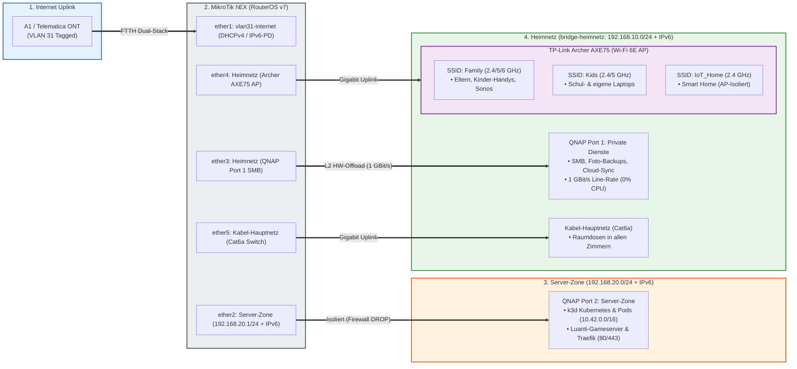

<style>
  @media print {
    @page {
      size: A4 portrait;
      margin: 1.2cm 1.2cm 1.4cm 1.2cm;
    }
    body {
      font-family: -apple-system, BlinkMacSystemFont, "Segoe UI", Roboto, "Helvetica Neue", Arial, sans-serif;
      font-size: 9pt;
      line-height: 1.35;
      color: #111;
      background: #fff;
    }
    h1 {
      font-size: 15pt;
      margin-top: 0;
      margin-bottom: 0.25em;
      page-break-after: avoid;
      break-after: avoid;
      color: #0b2545;
    }
    h2 {
      font-size: 11.5pt;
      margin-top: 0.8em;
      margin-bottom: 0.3em;
      page-break-after: avoid;
      break-after: avoid;
      border-bottom: 1px solid #134074;
      padding-bottom: 2px;
      color: #134074;
    }
    h3 {
      font-size: 9.5pt;
      margin-top: 0.6em;
      margin-bottom: 0.2em;
      page-break-after: avoid;
      break-after: avoid;
      color: #1d2d44;
    }
    table {
      width: 100% !important;
      border-collapse: collapse !important;
      margin: 0.4em 0 0.8em 0 !important;
      font-size: 8pt !important;
      page-break-inside: avoid;
      break-inside: avoid;
    }
    th, td {
      border: 1px solid #bbb !important;
      padding: 3.5px 6px !important;
      text-align: left;
      vertical-align: top;
    }
    th {
      background-color: #eef4f8 !important;
      -webkit-print-color-adjust: exact;
      print-color-adjust: exact;
      font-weight: 600;
      color: #0b2545;
    }
    pre, code {
      font-family: "SFMono-Regular", Consolas, "Liberation Mono", Menlo, monospace;
      font-size: 8pt;
    }
    pre {
      background: #f8f9fa !important;
      border: 1px solid #ddd !important;
      padding: 5px 8px;
      border-radius: 3px;
      page-break-inside: avoid;
      break-inside: avoid;
      white-space: pre-wrap;
      word-break: break-all;
    }
    p, ul, ol {
      margin-top: 0.25em;
      margin-bottom: 0.4em;
    }
    ul, ol {
      padding-left: 18px;
    }
    li {
      margin-bottom: 0.15em;
    }
    .page-break {
      page-break-before: always;
      break-before: page;
    }
    .no-break {
      page-break-inside: avoid;
      break-inside: avoid;
    }
    hr {
      border: 0;
      border-top: 1px solid #ddd;
      margin: 0.6em 0;
    }
  }
</style>

# MikroTik hEX (RB750Gr3) Dual-Stack Provisioning

Automatisierte Bereitstellung und gehärtete Konfiguration für MikroTik hEX Router (RouterOS v7) mit nativem Dual-Stack (IPv4 / IPv6-PD), FTTH VLAN 31 WAN-Uplink (A1/Telematica ONT) und isolierter **Server-Zone für k3d Kubernetes & Luanti-Gameserver**.

---

## 1. Netzwerk-Topologie & Architektur

<div class="no-break">



</div>

---

## 2. Subnetze & Port-Mapping

<div class="no-break">

| Zone / Subnetz | Interface | IP-Bereich (IPv4) | IPv6 | Zielgeräte / Funktion |
|---|---|---|---|---|
| **`INTERNET`** | `vlan31-internet` (ether1) | DHCP-Client (Default Route) | DHCPv6-PD (`/64`, Pool: `ipv6-pd`) | Uplink zu A1 / Telematica ONT (VLAN 31) |
| **`SERVER-ZONE`** | `ether2` | `192.168.20.1/24` (Pool: `.100-.200`) | SLAAC (`advertise=yes`) | QNAP Port 2: k3d Kubernetes, Luanti-Gameserver & Traefik |
| **`HEIMNETZ`** | `bridge-heimnetz` (ether3-5) | `192.168.10.1/24` (Pool: `.100-.200`) | SLAAC (`advertise=yes`) | Privates Familiennetzwerk (Details unten) |

</div>

### Port-Belegung im `HEIMNETZ` (ether3, ether4, ether5)
* **`ether3`:** QNAP NAS Port 1 $\rightarrow$ Interne Netzlaufwerke (SMB), automatische Foto-Backups, Cloud-Synchronisation und QTS Web-Administration.
* **`ether4`:** TP-Link Archer AXE75 (AP-Modus) $\rightarrow$ Verteilt die WLAN-Netzwerke (`Family`, `Kids`, `IoT_Home`).
* **`ether5`:** Kabel-Hauptnetz $\rightarrow$ Zentraler Switch mit Cat6a Raumverkabelung in alle Zimmer.

<div class="page-break"></div>

### WLAN SSIDs auf dem TP-Link Archer AXE75 (AP-Modus)

<div class="no-break">

| Netzwerk-Typ | SSID | Frequenzbänder | Zielgruppe / Verwendung | Zugriff auf QNAP Port 1 | Zugriff auf k3d Cluster |
|---|---|---|---|:---:|:---:|
| **Haupt-WLAN (Main)** | `Family` | 2,4 GHz / 5 GHz / 6 GHz (Smart Connect) | **Hauptnetz:** Eltern, Arbeitsrechner, Laptops, **Kinder-Smartphones**, **Sonos-Lautsprecher** | **JA (SMB / QTS)** | **JA (kubectl / Lens / Dev)** |
| **Kindernetz (WLAN)** | `Kids` | 2,4 GHz / 5 GHz (Separates Passwort) | **Schul- & Kinder-Laptops:** Schullaptops, persönliche Laptops der Kinder, Tablets | **JA (SMB / Streaming)** | **JA (Web / Games)** |
| **IoT-Netzwerk** | `IoT_Home` | 2,4 GHz | **Smart Home:** Saugroboter, Portasplit, isolierte IoT-Aktoren (*AP-Isolation aktiv*) | **NEIN (Geblockt)** | **NEIN (Geblockt)** |

</div>

---

## 3. Zugriffs- & Sicherheits-Matrix

<div class="no-break">

| Quell-Zone | Ziel-Zone | Zugriff | Schutzmechanismus & Performance |
|---|---|:---:|---|
| **`Kabel-Hauptnetz` (ether5)** | **QNAP Port 1 (SMB / QTS)** | **ERLAUBT** | **L2 Hardware Offloading:** Echte 1 GBit/s Leitungsgeschwindigkeit (<1ms Latenz, 0% CPU-Last) |
| **`Family` & `Kids` WLAN (ether4)** | **QNAP Port 1 (SMB / QTS)** | **ERLAUBT** | **High-Speed WLAN:** Direktes Gigabit-Switching auf `bridge-heimnetz` |
| **`HEIMNETZ`** | **`SERVER-ZONE` (k3d Cluster)** | **ERLAUBT** | Firewall Forward `HEIMNETZ -> SERVER-ZONE accept` (`kubectl`, Lens, Web) |
| **`SERVER-ZONE`** | **`HEIMNETZ` & QNAP Port 1** | **GEBLOCKT** | MikroTik Firewall Rule (`SERVER-ZONE -> HEIMNETZ DROP` in IPv4 & IPv6) |
| **`SERVER-ZONE`** | **`INTERNET` (WAN)** | **ERLAUBT** | Firewall Forward `SERVER-ZONE -> INTERNET accept` (Image Pulls, Helm, APIs) |
| **`IoT_Home` (Smart Home)** | **`HEIMNETZ` & QNAP Port 1** | **GEBLOCKT** | AP-Isolation auf dem Archer AXE75 (*Access Local Network: Disabled*) |
| **`INTERNET`** | **`HEIMNETZ` (Privat)** | **GEBLOCKT** | MikroTik Default Drop, kein NAT / kein Routing |
| **`INTERNET`** | **`SERVER-ZONE` (k3d Ingress)** | **NUR 80/443** | Optionales Port-Forwarding (dstnat) für Traefik Web-Ingress |

</div>

---

## 4. High-Performance & Hardware-Offloading (NAS-Zugriff)

* **MediaTek MT7621 Switch-Chip (Hardware Offloading `hw=yes`):**
  * Der Datenverkehr zwischen **Kabel-Hauptnetz (`ether5`)**, **WLAN Access Point (`ether4`)** und **QNAP NAS Port 1 (`ether3`)** wird direkt in Hardware auf dem Switch-Chip des MikroTik hEX verarbeitet.
  * **Zero CPU-Overhead:** Große Dateitransfers (SMB/NFS, TimeMachine Backups, Videostreaming) belasten den Router-Prozessor nicht und laufen mit voller Gigabit-Drahtgeschwindigkeit (115–120 MB/s).
* **Wi-Fi 6E Tri-Band Durchsatz:**
  * Laptops und Smartphones auf `SSID: Family` nutzen 5 GHz und 6 GHz Kanäle für maximale WLAN-Datenraten direkt zum NAS.
* **Server-Zone Isolation:** 
  * `HEIMNETZ` $\rightarrow$ `SERVER-ZONE` ist erlaubt (Management / `kubectl` / Dev-Testing).
  * `SERVER-ZONE` $\rightarrow$ `HEIMNETZ` wird **strikt geblockt** (`drop` in IPv4 & IPv6).
  * `SERVER-ZONE` $\rightarrow$ `INTERNET` ist erlaubt (Image-Pulls von `docker.io`, `registry.k8s.io`, `ghcr.io`, Helm Repos).
* **Router-Management & Hardening (Management Plane):**
  * **Dienste gehärtet:** Telnet, FTP, HTTP (WWW), API und API-SSL sind **vollständig deaktiviert**.
  * **Zugriffsbeschränkung:** WinBox und SSH sind ausschließlich aus dem `HEIMNETZ` (`192.168.10.0/24`) erreichbar.
  * **SSH-Sicherheit:** `strong-crypto=yes` forciert moderne kryptografische Ciphers.
  * **Layer-2 Härtung:** MAC-Server & MAC-Winbox sind strikt auf die Interface-Liste `HEIMNETZ` beschränkt; MAC-Ping ist deaktiviert.
  * **Schutz vor Informationslecks:** Neighbor Discovery (MNDP/CDP/LLDP) ist auf `INTERNET` und `SERVER-ZONE` deaktiviert (`discover-interface-list=HEIMNETZ`).
  * **Tools deaktiviert:** Bandwidth-Server, RoMON, UPnP, Web-Proxies und Cloud DDNS sind abgeschaltet.
  * **Hardware-Disziplin:** Alle LEDs über `/system leds disable [ find ]` deaktiviert.

<div class="page-break"></div>

## 5. Checkliste für Installation & Inbetriebnahme

### Phase 1: Physische Verkabelung
- [ ] **ether1 (WAN):** Mit LAN-Port des A1 / Telematica ONT verbinden.
- [ ] **ether2 (Server-Zone):** Mit **QNAP NAS Port 2** (k3d Cluster / DMZ) verbinden.
- [ ] **ether3 (Heimnetz):** Mit **QNAP NAS Port 1** (SMB / QTS Speicher) verbinden.
- [ ] **ether4 (Heimnetz):** Mit dem WAN/LAN-Port des **TP-Link Archer AXE75** verbinden.
- [ ] **ether5 (Kabel-Hauptnetz):** Mit dem zentralen **Gigabit-Switch** (Cat6a Raumverkabelung) verbinden.

---

### Phase 2: RouterOS Provisioning & Deployment
- [ ] **1. Router-Verbindung herstellen:** PC per LAN-Kabel an `ether3`, `ether4` oder `ether5` anschließen (Router hat ab Werk IP `192.168.88.1`).
- [ ] **2. Deployment-Skript ausführen:**
  ```bash
  ./deploy.sh [TARGET_IP] [USER] [PORT] [PASSWORD]
  ```
- [ ] **3. Admin-Passwort setzen:** Sofort via SSH oder WinBox auf `192.168.10.1` verbinden und ein starkes Passwort vergeben:
  ```routeros
  /user set admin password="DeinSicheresPasswort"
  ```
- [ ] **4. Status prüfen:** RouterOS Dual-Stack Status kontrollieren:
  ```routeros
  /ip dhcp-client print
  /ipv6 dhcp-client print
  /ip address print
  /ipv6 address print
  ```

---

### Phase 3: Konfiguration der Endgeräte

#### A. TP-Link Archer AXE75 (WLAN Access Point)
- [ ] **Betriebsmodus:** In der TP-Link Web-GUI auf **Access Point (AP-Modus)** umstellen.
- [ ] **SSID `Family` einrichten:** 2.4 / 5 / 6 GHz (Smart Connect), WPA2/WPA3 (Eltern, Laptops, Sonos, Kinder-Handys).
- [ ] **SSID `Kids` einrichten:** 2.4 / 5 GHz (Separates Passwort für Schul- & Kinder-Laptops, Tablets).
- [ ] **SSID `IoT_Home` einrichten:** Nur 2.4 GHz, WPA2. **"Access Local Network" / "AP-Isolation" AKTIVIEREN** (Smart Home).

#### B. QNAP NAS (QTS Betriebssystem)
- [ ] **Port 1 (Adapter 1 - Heimnetz):** Auf DHCP stellen $\rightarrow$ Erhält IP im Bereich `192.168.10.x`.
- [ ] **Port 2 (Adapter 2 - Server-Zone):** Auf DHCP stellen $\rightarrow$ Erhält IP im Bereich `192.168.20.x`.
- [ ] **Netzwerk-Prüfung:** Sicherstellen, dass **KEINE Bridge** zwischen Adapter 1 und Adapter 2 existiert.
- [ ] **Dienstebindung:** QTS Web-GUI & SMB nur auf Adapter 1; k3d Container-Cluster an Adapter 2 binden.

#### C. Sonos-Lautsprecher
- [ ] Alle Sonos-Boxen mit dem WLAN **`Family`** verbinden (oder per LAN-Kabel an Raumdosen anschließen).

---

### Phase 4: Sicherheits- & Funktionstests (Smoke Tests)
- [ ] **Test 1: Internetzugang:** `ping 1.1.1.1` und `ping6 google.com` prüfen.
- [ ] **Test 2: High-Speed NAS-Zugriff:** SMB-Freigabe (`\\192.168.10.x`) einbinden (Ziel: ~115 MB/s).
- [ ] **Test 3: k3d Cluster Management:** `kubectl get nodes` aus dem Heimnetz ausführen $\rightarrow$ **Erfolgreich**.
- [ ] **Test 4: DMZ-Isolation:** Aus Pod / Port 2: `ping 192.168.10.1` testen $\rightarrow$ **Muss fehlschlagen (DROP)**.

<div class="page-break"></div>

## 6. Checkliste für den laufenden Betrieb & Wartung

### Regelmäßige Wartung (Monatlich / Quartalsweise)
- [ ] **1. RouterOS Konfigurations-Backup erstellen:**
  ```routeros
  /export file=backup-config
  /system backup save name=backup-system
  ```
- [ ] **2. RouterOS Firmware-Updates prüfen (Stable Channel):**
  ```routeros
  /system package update check-for-updates
  /system package update download-and-install
  /system routerboard upgrade
  ```
- [ ] **3. QNAP & Container-Updates:** Regelmäßige Updates von QTS und den Kubernetes Pods in der Server-Zone durchführen.

---

## 7. Notfall / Factory Reset
Falls der Router nicht mehr erreichbar ist oder die Konfiguration zurückgesetzt werden soll:
1. Stromstecker des MikroTik hEX ziehen.
2. Reset-Taste (`RES`) mit einer Büroklammer gedrückt halten und Strom anschließen.
3. Warten bis die `USR`-LED blinkt (ca. 5–8 Sek.) und Taste sofort loslassen.
4. Router startet mit Werkseinstellungen (`192.168.88.1`). Anschließend `./deploy.sh` erneut ausführen.

---

## 8. RouterOS Quick-Reference Cheat Sheet

<div class="no-break">

| Prüfung / Aktion | RouterOS CLI-Befehl |
|---|---|
| **Schnittstellen & Link-Status** | `/interface print` |
| **Bridge-Ports & HW-Offload** | `/interface bridge port print` |
| **Sicherheitszonen (Interface-Lists)** | `/interface list member print` |
| **IPv4 Adressen & Gateways** | `/ip address print` |
| **IPv4 DHCP-Server Leases** | `/ip dhcp-server lease print` |
| **IPv6 Prefix Delegation Status** | `/ipv6 dhcp-client print` |
| **IPv6 Adressen (SLAAC)** | `/ipv6 address print` |
| **Firewall-Regeln & Drop-Counter** | `/ip firewall filter print stats` |
| **Aktive Verbindungen (Conntrack)** | `/ip firewall connection print` |
| **Systemressourcen & CPU-Last** | `/system resource print` |

</div>
