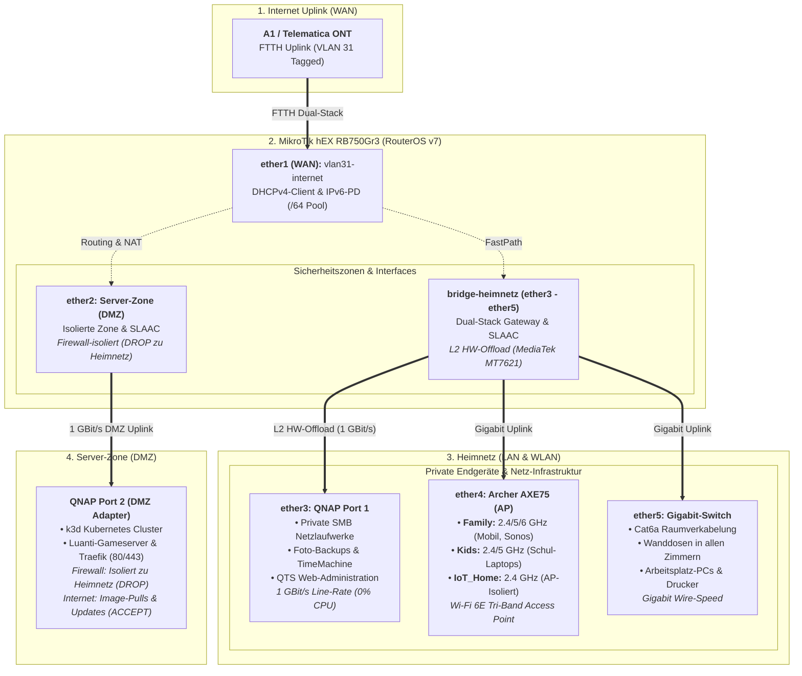

# MikroTik hEX (RB750Gr3) Dual-Stack Provisioning

Automatisierte Bereitstellung und gehärtete Konfiguration für MikroTik hEX Router (RouterOS v7) mit nativem Dual-Stack (IPv4 / IPv6-PD), FTTH VLAN 31 WAN-Uplink (A1/Telematica ONT) und isolierter **Server-Zone für k3d Kubernetes & Luanti-Gameserver**.

---

## 1. Netzwerk-Topologie & Architektur



---

## 2. Subnetze & Port-Mapping

| Zone / Subnetz | Interface(s) | IPv4-Gateway & Subnetz | IPv6-Konfiguration | Zielgeräte & Routing-Rolle |
|:---|:---|:---|:---|:---|
| **`INTERNET`** | `vlan31-internet` (ether1) | DHCP-Client *(Default Gateway)* | DHCPv6-PD (`/64`, Pool: `ipv6-pd`) | FTTH Uplink zu A1 / Telematica ONT (VLAN 31) |
| **`SERVER-ZONE`** | `ether2` | `192.168.20.1/24` *(Pool: .100–.200)* | SLAAC (`advertise=yes`) | **QNAP Port 2:** k3d Kubernetes, Luanti-Gameserver & Traefik |
| **`HEIMNETZ`** | `bridge-heimnetz` (ether3–5) | `192.168.10.1/24` *(Pool: .100–.200)* | SLAAC (`advertise=yes`) | **QNAP Port 1** (SMB), **Archer AXE75** (AP), **Cat6a Switch** |

### Port-Belegung im `HEIMNETZ` (ether3, ether4, ether5)
* **`ether3`:** QNAP NAS Port 1 → Interne Netzlaufwerke (SMB), automatische Foto-Backups, Cloud-Synchronisation und QTS Web-Administration.
* **`ether4`:** TP-Link Archer AXE75 (AP-Modus, feste IP: `192.168.10.2`) → Verteilt die WLAN-Netzwerke (`Family`, `Kids`, `IoT_Home`).
* **`ether5`:** Kabel-Hauptnetz → Zentraler Switch mit Cat6a Raumverkabelung in alle Zimmer.

### WLAN SSIDs auf dem TP-Link Archer AXE75 (AP-Modus)

| Netzwerk-Typ | SSID | Frequenz & Standard | Zielgruppe & Geräte | Zugriff auf QNAP Port 1 | Zugriff auf k3d Cluster |
|:---|:---|:---|:---|:---:|:---:|
| **Haupt-WLAN (Main)** | `Family` | 2,4 / 5 / 6 GHz (Wi-Fi 6E, WPA2/WPA3) | Eltern, Arbeitsrechner, Laptops, **Kinder-Handys**, **Sonos-Lautsprecher** | **✅ JA (SMB / QTS)** | **✅ JA (kubectl / Dev)** |
| **Kindernetz (WLAN)** | `Kids` | 2,4 / 5 GHz (Cloudflare Family DNS, sep. PW) | **Schul- & Kinder-Laptops:** Laptops der Kinder, Tablets, Streaming *(Jugendschutz aktiv)* | **✅ JA (SMB / Stream)** | **✅ JA (Web / Games)** |
| **IoT-Netzwerk** | `IoT_Home` | 2,4 GHz *(WPA2-only, AP-Isolation)* | **Smart Home:** Saugroboter, Portasplit, isolierte IoT-Aktoren | **⛔ NEIN (Geblockt)** | **⛔ NEIN (Geblockt)** |

### DNS-Architektur & Namensauflösung

| Hierarchie-Ebene | Resolver / Komponente | IP-Adresse(n) | Latenz | Funktion & Ausfallsicherung |
|:---|:---|:---|:---:|:---|
| **1. Stufe (Lokal)** | **MikroTik RAM-Cache** | `192.168.10.1` / IPv6 SLAAC | **~1–3 ms** | Blitzschnelle lokale Auflösung für alle Heimnetz- & WLAN-Clients |
| **2. Stufe (Primär)** | **Telematica DNS (Peer)** | `94.16.16.94`, `94.16.16.16` | **~5–8 ms** | Provider-eigene Resolver im Telematica/A1-Backbone (via DHCP) |
| **3. Stufe (Fallback)** | **Cloudflare DNS** | `1.1.1.1`, `2606:4700:4700::1111` | **~18 ms** | Redundanter Fallback bei Provider-Wartungsarbeiten oder Störungen |
| **KIDS-Schutzprofil** | **Cloudflare Family DNS** | `1.1.1.3`, `1.0.0.3` | **~18 ms** | Filtert automatisch Malware & jugendgefährdende Inhalte (Adult-Content) |

* **KIDS Jugendschutz-Enforcement:** Geräte der Adressliste `KIDS-DEVICES` erhalten per DHCP Option 6 direkt Cloudflare Family DNS. Port 53 (DNS) wird per Firewall-NAT zwingend umgeleitet (Manipulationsschutz), und DoT (Port 853) wird gesperrt.
* **Server-Zone Entkopplung:** Pods & Container in der `SERVER-ZONE` (`192.168.20.0/24`) erhalten per DHCP direkt externe DNS-Server (`1.1.1.1`, `8.8.8.8`), um den Router-Cache vor Lastspitzen durch Container-Image-Pulls zu schützen.

---

## 3. Zugriffs- & Sicherheits-Matrix

| Quell-Zone | Ziel-Zone | Status | Protokolle / Ports | Schutzmechanismus & Performance |
|:---|:---|:---:|:---|:---|
| **`Kabel-Hauptnetz` (ether5)** | **QNAP Port 1 (SMB / QTS)** | **🟢 ERLAUBT** | SMB (445), HTTPS (5001), NFS | **L2 Hardware Offloading:** Echte 1 GBit/s Line-Rate (<1 ms Latenz, 0% CPU-Last) |
| **`Family` & `Kids` WLAN (ether4)** | **QNAP Port 1 (SMB / QTS)** | **🟢 ERLAUBT** | SMB (445), HTTPS (5001), Streaming | **High-Speed WLAN:** Direktes Gigabit-Switching auf `bridge-heimnetz` |
| **`HEIMNETZ`** | **`SERVER-ZONE` (k3d Cluster)** | **🟢 ERLAUBT** | `kubectl` (6443), HTTPS (443), Luanti (30000) | MikroTik Firewall Forward: `HEIMNETZ -> SERVER-ZONE accept` |
| **`SERVER-ZONE`** | **`HEIMNETZ` & QNAP Port 1** | **🔴 GEBLOCKT** | Alle Protokolle & Ports | MikroTik Firewall Rule: `SERVER-ZONE -> HEIMNETZ DROP` (IPv4 & IPv6) |
| **`SERVER-ZONE`** | **`INTERNET` (WAN)** | **🟢 ERLAUBT** | HTTPS (443), HTTP (80), DNS (53), NTP (123) | MikroTik Firewall Forward: `SERVER-ZONE -> INTERNET accept` (Image Pulls, Updates) |
| **`KIDS-DEVICES`** | **`INTERNET` (DNS Port 53)** | **🟡 1.1.1.3** | UDP & TCP 53 | **DNS-Zwang (dst-nat):** Alle DNS-Anfragen werden zwingend auf Cloudflare Family umgeleitet |
| **`KIDS-DEVICES`** | **`INTERNET` (DoT Port 853)** | **🔴 GEBLOCKT** | TCP 853 | **DoT-Sperre:** Verhindert Umgehung des Filters via Android/iOS Private DNS |
| **`IoT_Home` (Smart Home)** | **`HEIMNETZ` & QNAP Port 1** | **🔴 GEBLOCKT** | Alle Protokolle & Ports | AP-Isolation auf dem Archer AXE75 (*Access Local Network: Disabled*) |
| **`INTERNET`** | **`HEIMNETZ` (Privat)** | **🔴 GEBLOCKT** | Alle eingehenden Anfragen | MikroTik Default Drop: Kein NAT / Routing auf private LAN-Clients |
| **`INTERNET`** | **`SERVER-ZONE` (k3d Ingress)** | **🟡 80/443** | Nur TCP 80 (HTTP) & TCP 443 (HTTPS) | Optionales Port-Forwarding (`dstnat`) exklusiv für Traefik Web-Ingress |

---

## 4. High-Performance & Hardware-Offloading (NAS-Zugriff)

* **MediaTek MT7621 Switch-Chip (Hardware Offloading `hw=yes`):**
  * Der Datenverkehr zwischen **Kabel-Hauptnetz (`ether5`)**, **WLAN Access Point (`ether4`)** und **QNAP NAS Port 1 (`ether3`)** wird direkt in Hardware auf dem Switch-Chip des MikroTik hEX verarbeitet.
  * **Zero CPU-Overhead:** Große Dateitransfers (SMB/NFS, TimeMachine Backups, Videostreaming) belasten den Router-Prozessor nicht und laufen mit voller Gigabit-Drahtgeschwindigkeit (115–120 MB/s).
* **FastTrack Hardware-Beschleunigung (IPv4 Forward):**
  * Etablierte IPv4-Verbindungen ins Internet werden über FastTrack beschleunigt, was die CPU-Last des Dual-Core-Prozessors bei vollen 1 GBit/s FTTH-Downloads auf unter 15% minimiert.
* **Präzise Zeitsynchronisation (SNTP & Europe/Vienna):**
  * Der integrierte SNTP-Client synchronisiert Systemzeit und Datum nach jedem Neustart automatisch mit `pool.ntp.org` (Zeitzone `Europe/Vienna`).
* **Wi-Fi 6E Tri-Band Durchsatz:**
  * Laptops und Smartphones auf `SSID: Family` nutzen 5 GHz und 6 GHz Kanäle für maximale WLAN-Datenraten direkt zum NAS.
* **Server-Zone Isolation:** 
  * `HEIMNETZ` → `SERVER-ZONE` ist erlaubt (Management / `kubectl` / Dev-Testing).
  * `SERVER-ZONE` → `HEIMNETZ` wird **strikt geblockt** (`drop` in IPv4 & IPv6).
  * `SERVER-ZONE` → `INTERNET` ist erlaubt (Image-Pulls von `docker.io`, `registry.k8s.io`, `ghcr.io`, Helm Repos).
* **Router-Management & Hardening (Management Plane):**
  * **Dienste gehärtet:** Telnet, FTP, HTTP (WWW), API und API-SSL sind **vollständig deaktiviert**.
  * **Zugriffsbeschränkung:** WinBox und SSH sind ausschließlich aus dem `HEIMNETZ` (`192.168.10.0/24`) erreichbar.
  * **SSH-Sicherheit:** `strong-crypto=yes` forciert moderne kryptografische Ciphers.
  * **Layer-2 Härtung:** MAC-Server & MAC-Winbox sind strikt auf die Interface-Liste `HEIMNETZ` beschränkt; MAC-Ping ist deaktiviert.
  * **Schutz vor Informationslecks:** Neighbor Discovery (MNDP/CDP/LLDP) ist auf `INTERNET` und `SERVER-ZONE` deaktiviert (`discover-interface-list=HEIMNETZ`).
  * **Tools deaktiviert:** Bandwidth-Server, RoMON, UPnP, Web-Proxies und Cloud DDNS sind abgeschaltet.
  * **Hardware-Disziplin:** Alle LEDs über `/system leds disable [ find ]` deaktiviert.

## 5. Schnellstart & Installation

Die vollständige Schritt-für-Schritt-Anleitung zur physischen Verkabelung, Erstinbetriebnahme, Endgeräte-Konfiguration und Smoke Tests befindet sich im separaten Leitfaden:

👉 **[Ausführlicher Installations-Leitfaden (INSTALL.md)](INSTALL.md)**

### Kurzüberblick: In 3 Schritten startklar

1. **Physisch verkabeln:** 
   * `ether1`: Internet-ONT (VLAN 31)
   * `ether2`: QNAP Port 2 (k3d DMZ)
   * `ether3`: QNAP Port 1 (SMB Speicher)
   * `ether4`: Archer AXE75 WLAN-AP
   * `ether5`: Gigabit-Switch (Kabelnetz)
2. **Bereitstellung ausführen:** PC per LAN an `ether3-5` anschließen und Skript starten:
   ```bash
   ./deploy.sh
   ```
   *(Erkennt automatisch, ob der Router auf `192.168.88.1` oder bereits auf `192.168.10.1` antwortet, und unterstützt SOPS).*
3. **Absichern & Endgeräte verbinden:** Admin-Passwort setzen, AP in AP-Modus versetzen und SSIDs einrichten (siehe [INSTALL.md](INSTALL.md)).

---

## 6. Checkliste für den laufenden Betrieb & Wartung

### Regelmäßige Wartung (Monatlich / Quartalsweise)
- [ ] **1. RouterOS Konfigurations-Backup erstellen:**
  ```routeros
  /export file=backup-config
  /system backup save name=backup-system
  ```
- [ ] **2. RouterOS Firmware-Updates prüfen (Stable Channel):**
  ```routeros
  /system package update check-for-updates
  /system package update download-and-install
  /system routerboard upgrade
  ```
- [ ] **3. QNAP & Container-Updates:** Regelmäßige Updates von QTS und den Kubernetes Pods in der Server-Zone durchführen.

---

## 7. RouterOS Quick-Reference Cheat Sheet

| Kategorie | Prüfpunkt / Funktion | RouterOS v7 CLI-Befehl | Erwartetes Ergebnis / Fokus |
|:---|:---|:---|:---|
| **Hardware & L2** | Schnittstellen & Link-Status | `/interface print` | Status `R` (Running), 1 GBit/s Full-Duplex |
| **Hardware & L2** | Bridge-Ports & HW-Offload | `/interface bridge port print` | Flag `H` (HW-Offload) aktiv auf ether3, 4, 5 |
| **Zonen & Listen** | Sicherheitszonen-Mitglieder | `/interface list member print` | `WAN`, `HEIMNETZ` und `SERVER-ZONE` Zuordnung |
| **IPv4 Netzwerk** | IP-Adressen & Subnetze | `/ip address print` | `192.168.10.1/24` (Heimnetz), `192.168.20.1/24` (DMZ) |
| **IPv4 Netzwerk** | DHCP-Server Leases | `/ip dhcp-server lease print` | Aktive Leases & Hostnames im Heimnetz/DMZ |
| **IPv6 Dual-Stack**| DHCPv6 Prefix Delegation | `/ipv6 dhcp-client print` | Status `bound`, `/64` Präfix bezogen |
| **IPv6 Dual-Stack**| IPv6 Adress-Pools (SLAAC) | `/ipv6 address print` | Globale IPv6 auf `bridge-heimnetz` und `ether2` |
| **Firewall** | Filter-Regeln & Drop-Counter | `/ip firewall filter print stats` | Prüfen der Paketzähler für DROP-Regeln |
| **Firewall** | Aktive Verbindungen (Conntrack) | `/ip firewall connection print` | Aktuelle TCP/UDP Session-Tabelle |
| **DNS & Cache** | Upstream-Server & Cache-RAM | `/ip dns print` | Telematica `dynamic-servers` & Cache-Größe |
| **Jugendschutz** | Aktive geschützte KIDS-Geräte | `/ip firewall address-list print where list="KIDS-DEVICES"` | Registrierte Kinder-Laptops & Tablets |
| **Kid-Control** | Zeitsteuerung Jugendschutz | `/ip kid-control print` | Profile (Antonia, Konstantin), Status & Zeitpläne |
| **Kid-Control** | Zugewiesene Geräte | `/ip kid-control device print` | Geräte-Status, Rate & Block-Status |
| **System** | CPU-Last & Systemressourcen | `/system resource print` | CPU-Auslastung (<5% bei L2 Line-Rate) |
| **System & Zeit** | NTP-Synchronisation & Uhrzeit | `/system clock print` | Status & Zeitstempel (Europe/Vienna) |
| **System** | Live-Systemprotokoll | `/log print follow-only` | Echtzeit-Logs für DHCP, Login & Security-Events |

---

### Die wichtigsten RouterOS Befehle im Alltag

#### 1. DHCP-Leases & Endgeräte verwalten

```routeros
# Alle aktiven DHCP-Leases mit IP, MAC-Adresse und Hostname anzeigen:
/ip dhcp-server lease print

# Detaillierte Ansicht (inkl. Lease-Time, Ablaufzeit, Client-ID):
/ip dhcp-server lease print detail

# Nur dynamisch zugewiesene oder gebundene Geräte anzeigen:
/ip dhcp-server lease print where status=bound

# Dynamischen Lease in einen statischen Lease umwandeln:
/ip dhcp-server lease make-static [ find mac-address="XX:XX:XX:XX:XX:XX" ]

# Kommentar setzen (z. B. Gerätenamen vergeben):
/ip dhcp-server lease set [ find mac-address="XX:XX:XX:XX:XX:XX" ] comment="A56s Frau"

# Gerät in Jugendschutz-Profil (KIDS-DEVICES + Cloudflare Family DNS) aufnehmen:
/ip dhcp-server lease set [ find mac-address="XX:XX:XX:XX:XX:XX" ] dhcp-option=dns-cloudflare-family address-list=KIDS-DEVICES comment="Kind 1 Laptop"

# Gerät wieder aus dem Jugendschutz entfernen (Standard-Heimnetz):
/ip dhcp-server lease set [ find mac-address="XX:XX:XX:XX:XX:XX" ] dhcp-option-set="" address-list="" comment="Familien-Gerät"

# Aktuelle ARP-Tabelle einsehen (alle im L2-Segment gesehenen MAC/IP-Paare):
/ip arp print
```

#### 2. Physische Zuordnung & WLAN-Ports prüfen

```routeros
# Zeigt an, über welchen Router-Port (z. B. ether4 = WLAN-AP) eine MAC-Adresse gelernt wurde:
/interface bridge host print where bridge=bridge-heimnetz

# Nur Geräte anzeigen, die über den WLAN Access Point (ether4) verbunden sind:
/interface bridge host print where on-interface=ether4

# Schnittstellen-Status und Link-Geschwindigkeit prüfen (1 GBit/s, Half/Full Duplex):
/interface ethernet print
```

#### 3. Live-Monitoring & Traffic-Analyse

```routeros
# Echtzeit-Bandbreitenmonitor für Internet-Uplink, WLAN-AP und Heimnetz-Bridge:
/interface monitor-traffic ether1,ether4,bridge-heimnetz

# Aktive TCP/UDP-Verbindungen (Connection Tracking) anzeigen:
/ip firewall connection print

# Verbindungen eines bestimmten Geräts filtern:
/ip firewall connection print where src-address~"192.168.10.18"

# Firewall-Paketzähler und geblockte Pakete prüfen:
/ip firewall filter print stats
/ip firewall filter print stats where action=drop
/ip firewall nat print stats
```

#### 4. DNS & Konnektivitätstests

```routeros
# DNS-Auflösung direkt auf dem Router testen:
:put [:resolve heise.de]
:put [:resolve google.com server=1.1.1.3]

# DNS-Cache des MikroTik anzeigen & leeren:
/ip dns cache print
/ip dns cache flush

# Ping und Traceroute ausführen:
/ping 1.1.1.1 count=4
/ping 2606:4700:4700::1111 count=4
/tool traceroute 1.1.1.1

# IPv6 Prefix Delegation und Adressen prüfen:
/ipv6 dhcp-client print detail
/ipv6 address print
/ipv6 neighbor print
```

#### 5. Kid-Control Zeitsteuerung (Internet-Sperre 24:00 - 06:00)

```routeros
# Status der Kinder-Profile anzeigen (Online/Gesperrt/Rate-Limit):
/ip kid-control print detail

# Zugewiesene Endgeräte und deren aktuellen Verbindungsstatus einsehen:
/ip kid-control device print detail

# Neues Gerät zu einem Profil zuordnen (z. B. für Konstantin):
/ip kid-control device add name="Konstantin-Handy" mac-address="XX:XX:XX:XX:XX:XX" user="Konstantin"

# Manuelle Schnell-Pause (Internet sofort sperren bzw. wieder freigeben):
/ip kid-control pause [ find name="Antonia" ]
/ip kid-control resume [ find name="Antonia" ]
```

#### 6. System-Wartung, Logs & Backups

```routeros
# Live-Systemprotokoll mitlaufend anzeigen (Strg+C zum Beenden):
/log print follow

# Nur DHCP-Ereignisse (Anfragen, Zuweisungen, Erneuerungen) anzeigen:
/log print where topics~"dhcp"

# Vollständige Konfiguration lesbar als RSC-Datei exportieren:
/export file=aktuelles-setup.rsc

# Binäres Komplett-Backup des Systems erstellen:
/system backup save name=backup-full

# Router sicher neustarten:
/system reboot
```

---

## 8. Secret Management & SOPS-Verschlüsselung

Dieses Repository trennt strikt zwischen **öffentlicher Architektur-Dokumentation** und **sensiblen lokalen Netzwerkdaten** (reale MAC-Adressen, Hostnamen und Passwörter via SOPS & age):

* **Verschlüsselte Produktionsdaten im Git:** `setup.enc.rsc` und `inventory.enc.yaml` (mit age-Key geschützt, transparent über Git-Diff einsehbar)
* **Lokale Klartext-Dateien:** `inventory.yaml` und `setup.rsc` (in `.gitignore` & durch Pre-Commit-Hooks vor versehentlichem Commit geschützt)

Ausführliche Details zur Verschlüsselung, den automatisierten Git-Hooks (`git scommit`) und der lokalen Verwaltung finden sich im Installations-Leitfaden:

👉 **[Secret Management & SOPS-Verschlüsselung in INSTALL.md](INSTALL.md#secret-management--sops-verschlüsselung)**


