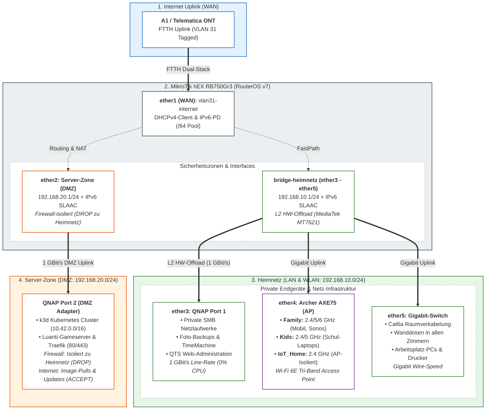

<style>
  /* Screen & Base Table Styling */
  table {
    width: 100%;
    border-collapse: collapse;
    margin: 0.6em 0 1em 0;
    font-size: 8.5pt;
  }
  th, td {
    border: 1px solid #cbd5e1;
    padding: 5px 8px;
    text-align: left;
    vertical-align: middle;
  }
  th {
    background-color: #f1f5f9;
    font-weight: 600;
    color: #0b2545;
  }
  tr:nth-child(even) td {
    background-color: #f8fafc;
  }
  .badge-allow {
    color: #1b5e20;
    font-weight: 700;
    white-space: nowrap;
  }
  .badge-drop {
    color: #b71c1c;
    font-weight: 700;
    white-space: nowrap;
  }
  .badge-warn {
    color: #b26a00;
    font-weight: 700;
    white-space: nowrap;
  }

  @media print {
    @page {
      size: A4 portrait;
      margin: 1.2cm 1.2cm 1.4cm 1.2cm;
    }
    body {
      font-family: -apple-system, BlinkMacSystemFont, "Segoe UI", Roboto, "Helvetica Neue", Arial, sans-serif;
      font-size: 9pt;
      line-height: 1.35;
      color: #111;
      background: #fff;
    }
    h1 {
      font-size: 15pt;
      margin-top: 0;
      margin-bottom: 0.25em;
      page-break-after: avoid;
      break-after: avoid;
      color: #0b2545;
    }
    h2 {
      font-size: 11.5pt;
      margin-top: 0.8em;
      margin-bottom: 0.3em;
      page-break-after: avoid;
      break-after: avoid;
      border-bottom: 1px solid #134074;
      padding-bottom: 2px;
      color: #134074;
    }
    h3 {
      font-size: 9.5pt;
      margin-top: 0.6em;
      margin-bottom: 0.2em;
      page-break-after: avoid;
      break-after: avoid;
      color: #1d2d44;
    }
    table {
      width: 100% !important;
      border-collapse: collapse !important;
      margin: 0.3em 0 0.6em 0 !important;
      font-size: 7.5pt !important;
      page-break-inside: avoid;
      break-inside: avoid;
    }
    th, td {
      border: 1px solid #cbd5e1 !important;
      padding: 3px 6px !important;
      text-align: left;
      vertical-align: middle;
    }
    th {
      background-color: #e2e8f0 !important;
      -webkit-print-color-adjust: exact;
      print-color-adjust: exact;
      font-weight: 600;
      color: #0b2545;
    }
    tr:nth-child(even) td {
      background-color: #f8fafc !important;
      -webkit-print-color-adjust: exact;
      print-color-adjust: exact;
    }
    td code, th code {
      font-size: 7.2pt !important;
      padding: 1px 3px !important;
      background: #f1f5f9 !important;
      border: 1px solid #e2e8f0 !important;
      border-radius: 2px !important;
      white-space: nowrap !important;
    }
    .badge-allow {
      color: #1b5e20 !important;
      -webkit-print-color-adjust: exact;
      print-color-adjust: exact;
    }
    .badge-drop {
      color: #b71c1c !important;
      -webkit-print-color-adjust: exact;
      print-color-adjust: exact;
    }
    .badge-warn {
      color: #b26a00 !important;
      -webkit-print-color-adjust: exact;
      print-color-adjust: exact;
    }
    pre, code {
      font-family: "SFMono-Regular", Consolas, "Liberation Mono", Menlo, monospace;
      font-size: 8pt;
    }
    pre {
      background: #f8f9fa !important;
      border: 1px solid #ddd !important;
      padding: 5px 8px;
      border-radius: 3px;
      page-break-inside: avoid;
      break-inside: avoid;
      white-space: pre-wrap;
      word-break: break-all;
    }
    p, ul, ol {
      margin-top: 0.25em;
      margin-bottom: 0.4em;
    }
    ul, ol {
      padding-left: 18px;
    }
    li {
      margin-bottom: 0.15em;
    }
    .page-break {
      page-break-before: always;
      break-before: page;
    }
    .no-break {
      page-break-inside: avoid;
      break-inside: avoid;
    }
    .mermaid, svg {
      max-width: 100% !important;
      height: auto !important;
      display: block;
      margin: 0.4em auto 0.6em auto !important;
      page-break-inside: avoid;
      break-inside: avoid;
      -webkit-print-color-adjust: exact;
      print-color-adjust: exact;
    }
    hr {
      border: 0;
      border-top: 1px solid #ddd;
      margin: 0.6em 0;
    }
  }
</style>

# MikroTik hEX (RB750Gr3) Dual-Stack Provisioning

Automatisierte Bereitstellung und gehärtete Konfiguration für MikroTik hEX Router (RouterOS v7) mit nativem Dual-Stack (IPv4 / IPv6-PD), FTTH VLAN 31 WAN-Uplink (A1/Telematica ONT) und isolierter **Server-Zone für k3d Kubernetes & Luanti-Gameserver**.

---

## 1. Netzwerk-Topologie & Architektur

<div class="no-break">



</div>

---

## 2. Subnetze & Port-Mapping

<div class="no-break">

| Zone / Subnetz | Interface(s) | IPv4-Gateway & Subnetz | IPv6-Konfiguration | Zielgeräte & Routing-Rolle |
|:---|:---|:---|:---|:---|
| **`INTERNET`** | `vlan31-internet` (ether1) | DHCP-Client *(Default Gateway)* | DHCPv6-PD (`/64`, Pool: `ipv6-pd`) | FTTH Uplink zu A1 / Telematica ONT (VLAN 31) |
| **`SERVER-ZONE`** | `ether2` | `192.168.20.1/24` *(Pool: .100–.200)* | SLAAC (`advertise=yes`) | **QNAP Port 2:** k3d Kubernetes, Luanti-Gameserver & Traefik |
| **`HEIMNETZ`** | `bridge-heimnetz` (ether3–5) | `192.168.10.1/24` *(Pool: .100–.200)* | SLAAC (`advertise=yes`) | **QNAP Port 1** (SMB), **Archer AXE75** (AP), **Cat6a Switch** |

</div>

### Port-Belegung im `HEIMNETZ` (ether3, ether4, ether5)
* **`ether3`:** QNAP NAS Port 1 $\rightarrow$ Interne Netzlaufwerke (SMB), automatische Foto-Backups, Cloud-Synchronisation und QTS Web-Administration.
* **`ether4`:** TP-Link Archer AXE75 (AP-Modus, feste IP: `192.168.10.2`) $\rightarrow$ Verteilt die WLAN-Netzwerke (`Family`, `Kids`, `IoT_Home`).
* **`ether5`:** Kabel-Hauptnetz $\rightarrow$ Zentraler Switch mit Cat6a Raumverkabelung in alle Zimmer.

<div class="page-break"></div>

### WLAN SSIDs auf dem TP-Link Archer AXE75 (AP-Modus)

<div class="no-break">

| Netzwerk-Typ | SSID | Frequenz & Standard | Zielgruppe & Geräte | Zugriff auf QNAP Port 1 | Zugriff auf k3d Cluster |
|:---|:---|:---|:---|:---:|:---:|
| **Haupt-WLAN (Main)** | `Family` | 2,4 / 5 / 6 GHz (Wi-Fi 6E, WPA2/WPA3) | Eltern, Arbeitsrechner, Laptops, **Kinder-Handys**, **Sonos-Lautsprecher** | <span class="badge-allow">✅ JA (SMB / QTS)</span> | <span class="badge-allow">✅ JA (kubectl / Dev)</span> |
| **Kindernetz (WLAN)** | `Kids` | 2,4 / 5 GHz (Cloudflare Family DNS, sep. PW) | **Schul- & Kinder-Laptops:** Laptops der Kinder, Tablets, Streaming *(Jugendschutz aktiv)* | <span class="badge-allow">✅ JA (SMB / Stream)</span> | <span class="badge-allow">✅ JA (Web / Games)</span> |
| **IoT-Netzwerk** | `IoT_Home` | 2,4 GHz *(WPA2-only, AP-Isolation)* | **Smart Home:** Saugroboter, Portasplit, isolierte IoT-Aktoren | <span class="badge-drop">⛔ NEIN (Geblockt)</span> | <span class="badge-drop">⛔ NEIN (Geblockt)</span> |

</div>

### DNS-Architektur & Namensauflösung

<div class="no-break">

| Hierarchie-Ebene | Resolver / Komponente | IP-Adresse(n) | Latenz | Funktion & Ausfallsicherung |
|:---|:---|:---|:---:|:---|
| **1. Stufe (Lokal)** | **MikroTik RAM-Cache** | `192.168.10.1` / IPv6 SLAAC | **~1–3 ms** | Blitzschnelle lokale Auflösung für alle Heimnetz- & WLAN-Clients |
| **2. Stufe (Primär)** | **Telematica DNS (Peer)** | `94.16.16.94`, `94.16.16.16` | **~5–8 ms** | Provider-eigene Resolver im Telematica/A1-Backbone (via DHCP) |
| **3. Stufe (Fallback)** | **Cloudflare DNS** | `1.1.1.1`, `2606:4700:4700::1111` | **~18 ms** | Redundanter Fallback bei Provider-Wartungsarbeiten oder Störungen |
| **KIDS-Schutzprofil** | **Cloudflare Family DNS** | `1.1.1.3`, `1.0.0.3` | **~18 ms** | Filtert automatisch Malware & jugendgefährdende Inhalte (Adult-Content) |

* **KIDS Jugendschutz-Enforcement:** Geräte der Adressliste `KIDS-DEVICES` erhalten per DHCP Option 6 direkt Cloudflare Family DNS. Port 53 (DNS) wird per Firewall-NAT zwingend umgeleitet (Manipulationsschutz), und DoT (Port 853) wird gesperrt.
* **Server-Zone Entkopplung:** Pods & Container in der `SERVER-ZONE` (`192.168.20.0/24`) erhalten per DHCP direkt externe DNS-Server (`1.1.1.1`, `8.8.8.8`), um den Router-Cache vor Lastspitzen durch Container-Image-Pulls zu schützen.

</div>

---

## 3. Zugriffs- & Sicherheits-Matrix

<div class="no-break">

| Quell-Zone | Ziel-Zone | Status | Protokolle / Ports | Schutzmechanismus & Performance |
|:---|:---|:---:|:---|:---|
| **`Kabel-Hauptnetz` (ether5)** | **QNAP Port 1 (SMB / QTS)** | <span class="badge-allow">🟢 ERLAUBT</span> | SMB (445), HTTPS (5001), NFS | **L2 Hardware Offloading:** Echte 1 GBit/s Line-Rate (<1 ms Latenz, 0% CPU-Last) |
| **`Family` & `Kids` WLAN (ether4)** | **QNAP Port 1 (SMB / QTS)** | <span class="badge-allow">🟢 ERLAUBT</span> | SMB (445), HTTPS (5001), Streaming | **High-Speed WLAN:** Direktes Gigabit-Switching auf `bridge-heimnetz` |
| **`HEIMNETZ`** | **`SERVER-ZONE` (k3d Cluster)** | <span class="badge-allow">🟢 ERLAUBT</span> | `kubectl` (6443), HTTPS (443), Luanti (30000) | MikroTik Firewall Forward: `HEIMNETZ -> SERVER-ZONE accept` |
| **`SERVER-ZONE`** | **`HEIMNETZ` & QNAP Port 1** | <span class="badge-drop">🔴 GEBLOCKT</span> | Alle Protokolle & Ports | MikroTik Firewall Rule: `SERVER-ZONE -> HEIMNETZ DROP` (IPv4 & IPv6) |
| **`SERVER-ZONE`** | **`INTERNET` (WAN)** | <span class="badge-allow">🟢 ERLAUBT</span> | HTTPS (443), HTTP (80), DNS (53), NTP (123) | MikroTik Firewall Forward: `SERVER-ZONE -> INTERNET accept` (Image Pulls, Updates) |
| **`KIDS-DEVICES`** | **`INTERNET` (DNS Port 53)** | <span class="badge-warn">🟡 1.1.1.3</span> | UDP & TCP 53 | **DNS-Zwang (dst-nat):** Alle DNS-Anfragen werden zwingend auf Cloudflare Family umgeleitet |
| **`KIDS-DEVICES`** | **`INTERNET` (DoT Port 853)** | <span class="badge-drop">🔴 GEBLOCKT</span> | TCP 853 | **DoT-Sperre:** Verhindert Umgehung des Filters via Android/iOS Private DNS |
| **`IoT_Home` (Smart Home)** | **`HEIMNETZ` & QNAP Port 1** | <span class="badge-drop">🔴 GEBLOCKT</span> | Alle Protokolle & Ports | AP-Isolation auf dem Archer AXE75 (*Access Local Network: Disabled*) |
| **`INTERNET`** | **`HEIMNETZ` (Privat)** | <span class="badge-drop">🔴 GEBLOCKT</span> | Alle eingehenden Anfragen | MikroTik Default Drop: Kein NAT / Routing auf private LAN-Clients |
| **`INTERNET`** | **`SERVER-ZONE` (k3d Ingress)** | <span class="badge-warn">🟡 80/443</span> | Nur TCP 80 (HTTP) & TCP 443 (HTTPS) | Optionales Port-Forwarding (`dstnat`) exklusiv für Traefik Web-Ingress |

</div>

---

## 4. High-Performance & Hardware-Offloading (NAS-Zugriff)

* **MediaTek MT7621 Switch-Chip (Hardware Offloading `hw=yes`):**
  * Der Datenverkehr zwischen **Kabel-Hauptnetz (`ether5`)**, **WLAN Access Point (`ether4`)** und **QNAP NAS Port 1 (`ether3`)** wird direkt in Hardware auf dem Switch-Chip des MikroTik hEX verarbeitet.
  * **Zero CPU-Overhead:** Große Dateitransfers (SMB/NFS, TimeMachine Backups, Videostreaming) belasten den Router-Prozessor nicht und laufen mit voller Gigabit-Drahtgeschwindigkeit (115–120 MB/s).
* **Wi-Fi 6E Tri-Band Durchsatz:**
  * Laptops und Smartphones auf `SSID: Family` nutzen 5 GHz und 6 GHz Kanäle für maximale WLAN-Datenraten direkt zum NAS.
* **Server-Zone Isolation:** 
  * `HEIMNETZ` $\rightarrow$ `SERVER-ZONE` ist erlaubt (Management / `kubectl` / Dev-Testing).
  * `SERVER-ZONE` $\rightarrow$ `HEIMNETZ` wird **strikt geblockt** (`drop` in IPv4 & IPv6).
  * `SERVER-ZONE` $\rightarrow$ `INTERNET` ist erlaubt (Image-Pulls von `docker.io`, `registry.k8s.io`, `ghcr.io`, Helm Repos).
* **Router-Management & Hardening (Management Plane):**
  * **Dienste gehärtet:** Telnet, FTP, HTTP (WWW), API und API-SSL sind **vollständig deaktiviert**.
  * **Zugriffsbeschränkung:** WinBox und SSH sind ausschließlich aus dem `HEIMNETZ` (`192.168.10.0/24`) erreichbar.
  * **SSH-Sicherheit:** `strong-crypto=yes` forciert moderne kryptografische Ciphers.
  * **Layer-2 Härtung:** MAC-Server & MAC-Winbox sind strikt auf die Interface-Liste `HEIMNETZ` beschränkt; MAC-Ping ist deaktiviert.
  * **Schutz vor Informationslecks:** Neighbor Discovery (MNDP/CDP/LLDP) ist auf `INTERNET` und `SERVER-ZONE` deaktiviert (`discover-interface-list=HEIMNETZ`).
  * **Tools deaktiviert:** Bandwidth-Server, RoMON, UPnP, Web-Proxies und Cloud DDNS sind abgeschaltet.
  * **Hardware-Disziplin:** Alle LEDs über `/system leds disable [ find ]` deaktiviert.

<div class="page-break"></div>

## 5. Checkliste für Installation & Inbetriebnahme

### Phase 1: Physische Verkabelung
- [ ] **ether1 (WAN):** Mit LAN-Port des A1 / Telematica ONT verbinden.
- [ ] **ether2 (Server-Zone):** Mit **QNAP NAS Port 2** (k3d Cluster / DMZ) verbinden.
- [ ] **ether3 (Heimnetz):** Mit **QNAP NAS Port 1** (SMB / QTS Speicher) verbinden.
- [ ] **ether4 (Heimnetz):** Mit dem WAN/LAN-Port des **TP-Link Archer AXE75** verbinden.
- [ ] **ether5 (Kabel-Hauptnetz):** Mit dem zentralen **Gigabit-Switch** (Cat6a Raumverkabelung) verbinden.

---

### Phase 2: RouterOS Provisioning & Deployment
- [ ] **1. Router-Verbindung herstellen:** PC per LAN-Kabel an `ether3`, `ether4` oder `ether5` anschließen (Router hat ab Werk IP `192.168.88.1`).
- [ ] **2. Deployment-Skript ausführen:**
  ```bash
  ./deploy.sh [TARGET_IP] [USER] [PORT] [PASSWORD]
  ```
- [ ] **3. Admin-Passwort setzen:** Sofort via SSH oder WinBox auf `192.168.10.1` verbinden und ein starkes Passwort vergeben:
  ```routeros
  /user set admin password="DeinSicheresPasswort"
  ```
- [ ] **4. Status prüfen:** RouterOS Dual-Stack Status kontrollieren:
  ```routeros
  /ip dhcp-client print
  /ipv6 dhcp-client print
  /ip address print
  /ipv6 address print
  ```

---

### Phase 3: Konfiguration der Endgeräte

#### A. TP-Link Archer AXE75 (WLAN Access Point)
- [ ] **Admin-Zugriff:** Erreichbar unter **http://192.168.10.2** (feste DHCP-Reservierung im MikroTik via MAC `50:91:E3:F4:0B:40`).
- [ ] **Betriebsmodus:** In der TP-Link Web-GUI auf **Access Point (AP-Modus)** umstellen.
- [ ] **SSID `Family` einrichten:** 2.4 / 5 / 6 GHz (Smart Connect), WPA2/WPA3 (Eltern, Laptops, Sonos, Kinder-Handys).
- [ ] **SSID `Kids` einrichten:** 2.4 / 5 GHz (Separates Passwort für Schul- & Kinder-Laptops, Tablets).
- [ ] **SSID `IoT_Home` einrichten:** Nur 2.4 GHz, WPA2. **"Access Local Network" / "AP-Isolation" AKTIVIEREN** (Smart Home).

#### B. QNAP NAS (QTS Betriebssystem)
- [ ] **Port 1 (Adapter 1 - Heimnetz):** Auf DHCP stellen $\rightarrow$ Erhält IP im Bereich `192.168.10.x`.
- [ ] **Port 2 (Adapter 2 - Server-Zone):** Auf DHCP stellen $\rightarrow$ Erhält IP im Bereich `192.168.20.x`.
- [ ] **Netzwerk-Prüfung:** Sicherstellen, dass **KEINE Bridge** zwischen Adapter 1 und Adapter 2 existiert.
- [ ] **Dienstebindung:** QTS Web-GUI & SMB nur auf Adapter 1; k3d Container-Cluster an Adapter 2 binden.

#### C. Sonos-Lautsprecher
- [ ] Alle Sonos-Boxen mit dem WLAN **`Family`** verbinden (oder per LAN-Kabel an Raumdosen anschließen).

#### D. Kinder-Endgeräte (KIDS-WLAN & Jugendschutz)
- [ ] **WLAN-Verbindung:** Schul- & Kinder-Laptops, Tablets und Smartphones mit SSID **`Kids`** verbinden.
- [ ] **MAC-Randomisierung deaktivieren:** In den WLAN-Einstellungen des Geräts **„Private WLAN-Adresse“ auf „Aus“** stellen.
- [ ] **Als geschütztes KIDS-Gerät im MikroTik registrieren:**
  ```routeros
  # Gerät als statischen Lease mit Cloudflare Family DNS & Adressliste KIDS-DEVICES festlegen:
  /ip dhcp-server lease make-static [ find mac-address="XX:XX:XX:XX:XX:XX" ]
  /ip dhcp-server lease set [ find mac-address="XX:XX:XX:XX:XX:XX" ] dhcp-option-set=optset-kids address-list=KIDS-DEVICES comment="Kind 1 Laptop"
  ```

---

### Phase 4: Sicherheits- & Funktionstests (Smoke Tests)
- [ ] **Test 1: Internetzugang:** `ping 1.1.1.1` und `ping6 google.com` prüfen.
- [ ] **Test 2: High-Speed NAS-Zugriff:** SMB-Freigabe (`\\192.168.10.x`) einbinden (Ziel: ~115 MB/s).
- [ ] **Test 3: k3d Cluster Management:** `kubectl get nodes` aus dem Heimnetz ausführen $\rightarrow$ **Erfolgreich**.
- [ ] **Test 4: DMZ-Isolation:** Aus Pod / Port 2: `ping 192.168.10.1` testen $\rightarrow$ **Muss fehlschlagen (DROP)**.

<div class="page-break"></div>

## 6. Checkliste für den laufenden Betrieb & Wartung

### Regelmäßige Wartung (Monatlich / Quartalsweise)
- [ ] **1. RouterOS Konfigurations-Backup erstellen:**
  ```routeros
  /export file=backup-config
  /system backup save name=backup-system
  ```
- [ ] **2. RouterOS Firmware-Updates prüfen (Stable Channel):**
  ```routeros
  /system package update check-for-updates
  /system package update download-and-install
  /system routerboard upgrade
  ```
- [ ] **3. QNAP & Container-Updates:** Regelmäßige Updates von QTS und den Kubernetes Pods in der Server-Zone durchführen.

---

## 7. Notfall / Factory Reset
Falls der Router nicht mehr erreichbar ist oder die Konfiguration zurückgesetzt werden soll:
1. Stromstecker des MikroTik hEX ziehen.
2. Reset-Taste (`RES`) mit einer Büroklammer gedrückt halten und Strom anschließen.
3. Warten bis die `USR`-LED blinkt (ca. 5–8 Sek.) und Taste sofort loslassen.
4. Router startet mit Werkseinstellungen (`192.168.88.1`). Anschließend `./deploy.sh` erneut ausführen.

---

## 8. RouterOS Quick-Reference Cheat Sheet

<div class="no-break">

| Kategorie | Prüfpunkt / Funktion | RouterOS v7 CLI-Befehl | Erwartetes Ergebnis / Fokus |
|:---|:---|:---|:---|
| **Hardware & L2** | Schnittstellen & Link-Status | `/interface print` | Status `R` (Running), 1 GBit/s Full-Duplex |
| **Hardware & L2** | Bridge-Ports & HW-Offload | `/interface bridge port print` | Flag `H` (HW-Offload) aktiv auf ether3, 4, 5 |
| **Zonen & Listen** | Sicherheitszonen-Mitglieder | `/interface list member print` | `WAN`, `HEIMNETZ` und `SERVER-ZONE` Zuordnung |
| **IPv4 Netzwerk** | IP-Adressen & Subnetze | `/ip address print` | `192.168.10.1/24` (Heimnetz), `192.168.20.1/24` (DMZ) |
| **IPv4 Netzwerk** | DHCP-Server Leases | `/ip dhcp-server lease print` | Aktive Leases & Hostnames im Heimnetz/DMZ |
| **IPv6 Dual-Stack**| DHCPv6 Prefix Delegation | `/ipv6 dhcp-client print` | Status `bound`, `/64` Präfix bezogen |
| **IPv6 Dual-Stack**| IPv6 Adress-Pools (SLAAC) | `/ipv6 address print` | Globale IPv6 auf `bridge-heimnetz` und `ether2` |
| **Firewall** | Filter-Regeln & Drop-Counter | `/ip firewall filter print stats` | Prüfen der Paketzähler für DROP-Regeln |
| **Firewall** | Aktive Verbindungen (Conntrack) | `/ip firewall connection print` | Aktuelle TCP/UDP Session-Tabelle |
| **DNS & Cache** | Upstream-Server & Cache-RAM | `/ip dns print` | Telematica `dynamic-servers` & Cache-Größe |
| **Jugendschutz** | Aktive geschützte KIDS-Geräte | `/ip firewall address-list print where list="KIDS-DEVICES"` | Registrierte Kinder-Laptops & Tablets |
| **System** | CPU-Last & Systemressourcen | `/system resource print` | CPU-Auslastung (<5% bei L2 Line-Rate) |
| **System** | Live-Systemprotokoll | `/log print follow-only` | Echtzeit-Logs für DHCP, Login & Security-Events |

</div>
