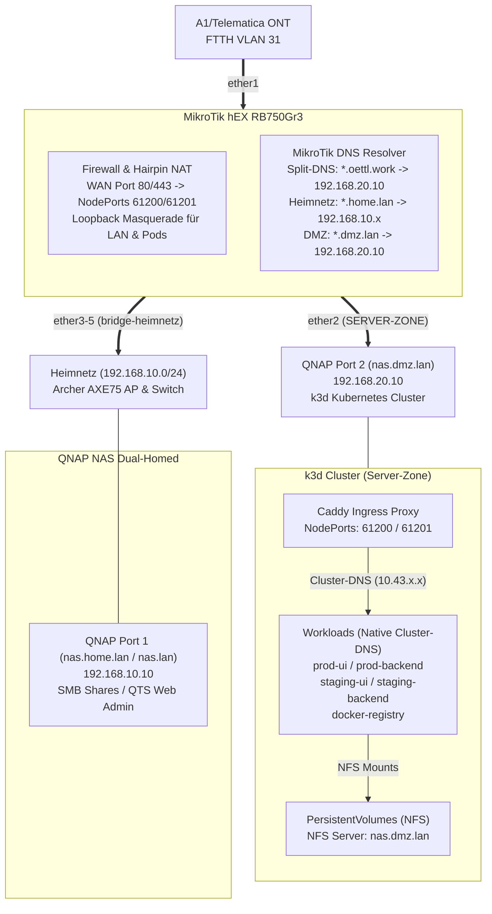

# MikroTik hEX (RB750Gr3) Dual-Stack Architecture Showcase

> [!NOTE]
> **Architektur- & Portfolio-Showcase:**
> Dieses Repository dient als öffentliche Dokumentation, Architektur-Referenz und Portfolio-Showcase für das Dual-Stack Homelab. Operative Provisionierungs-Skripte, reale Endgeräte-Inventare und Produktiv-Secrets werden in einem separaten, privaten Operations-Repository (`mikrotik-homelab-ops`) betrieben.

Idempotentes RouterOS v7 Architekturkonzept mit Dual-Stack (IPv4 / IPv6-PD), FTTH VLAN 31 WAN-Uplink und isolierter Server-Zone für k3d Kubernetes.

## Architektur



### Zonen & Subnetze

| Zone | Interface | IPv4 | IPv6 | Hostname | Zweck |
|:-----|:----------|:-----|:-----|:---------|:------|
| `INTERNET` | `vlan31-internet` (ether1) | DHCP-Client | DHCPv6-PD /64 | – | FTTH WAN Uplink |
| `SERVER-ZONE` | `ether2` | `192.168.20.1/24` | IPv4 NAT | `nas.dmz.lan` (`.20.10`) | k3d Cluster, Caddy Ingress, NFS-Storage, DBs |
| `HEIMNETZ` | `bridge-heimnetz` (ether3–5) | `192.168.10.1/24` | SLAAC /64 | `nas.home.lan` (`.10.10`) | QTS Admin, SMB Speicher, AP, Kabelnetz |

### Port-Belegung

| Port | Gerät | Zone | DNS Name |
|:-----|:------|:-----|:---------|
| `ether1` | ONT (VLAN 31) | INTERNET | – |
| `ether2` | QNAP Port 2 → k3d / Caddy Ingress | SERVER-ZONE | `nas.dmz.lan` (`192.168.20.10`) |
| `ether3` | QNAP Port 1 → SMB / QTS Web-UI | HEIMNETZ (HW-Offload) | `nas.home.lan` / `nas.lan` (`192.168.10.10`) |
| `ether4` | Archer AXE75 AP (Family + IoT) | HEIMNETZ (HW-Offload) | `ap.home.lan` / `ap.lan` (`192.168.10.2`) |
| `ether5` | Gigabit-Switch → Cat6a Dosen | HEIMNETZ (HW-Offload) | – |

---

## Sicherheitsmodell

### Firewall-Matrix (IPv4 & IPv6)

| Source → Dest | Status | Anmerkung |
|:--------------|:------:|:----------|
| `HEIMNETZ` → `INTERNET` | ✅ | FastTrack-beschleunigt |
| `HEIMNETZ` → `SERVER-ZONE` | ✅ | kubectl (`192.168.20.10:6443`), Lens, Dev Web |
| `SERVER-ZONE` → `INTERNET` | ✅ | Image Pulls, externe APIs |
| `SERVER-ZONE` → `HEIMNETZ` | 🔴 **DROP** | **Kritische Isolation** (Schutz für Heimnetz & QTS Port 1) |
| `INTERNET` → `SERVER-ZONE` | 🟡 80/443 | dstnat → Caddy Ingress (NodePorts 61200 / 61201) |
| `INTERNET` → `HEIMNETZ` | 🔴 **DROP** | Default Drop |

### Ingress & Hairpin-NAT

* **Caddy Ingress Reverse Proxy:** Terminiert SSL/TLS auf NodePort 61201 (HTTPS) und 61200 (HTTP).
* **Port-Forwarding (dstnat):** WAN Port 80/443 werden direkt auf die Caddy NodePorts gemappt.
* **Hairpin-NAT (Loopback Masquerade):** Erlaubt es internen Clients und Pods, öffentliche Hostnamen wie `registry.oettl.work` über die WAN-IP anzusprechen.
* **Cluster-internes DNS-Routing:** Caddy leitet Requests nicht über NodePorts oder Host-IPs weiter, sondern spricht Pods direkt über native Kubernetes Cluster-DNS-Namen an (`prod-ui.immoad-prod:1080`, `prod-backend.immoad-prod:5000`, etc.).

### Management Hardening

Deaktiviert: Telnet, FTP, HTTP, API, API-SSL, UPnP, Bandwidth-Server, RoMON, Cloud DDNS, LEDs.
Aktiv: SSH (`strong-crypto=yes`) + WinBox — nur aus `HEIMNETZ`.
L2: MAC-Server/Winbox + Neighbor Discovery auf `HEIMNETZ` beschränkt.

### DNS-Architektur

| Stufe | Resolver | Ziel |
|:------|:---------|:-----|
| Lokal | MikroTik Cache (`192.168.10.1`) | Alle Heimnetz-Clients |
| Heimnetz Gateway | MikroTik DNS | `router.home.lan`, `router.lan` → `192.168.10.1` (RouterOS Admin) |
| Heimnetz NAS Port 1 | MikroTik DNS | `nas.home.lan`, `nas.lan`, `nas160c30.lan` → `192.168.10.10` (Admin, SMB) |
| Heimnetz AP | MikroTik DNS | `ap.home.lan`, `ap.lan` → `192.168.10.2` (Archer AXE75 Web-GUI) |
| DMZ NAS Port 2 | MikroTik DNS | `nas.dmz.lan` → `192.168.20.10` (k3d Cluster Node, NFS Server) |
| DMZ Kubernetes API | MikroTik DNS | `k8s.dmz.lan` → `192.168.20.10` (k3s API Server `:6443`) |
| DMZ Monitoring | MikroTik DNS | `grafana.dmz.lan`, `prometheus.dmz.lan`, `alertmanager.dmz.lan` → `192.168.20.10` |
| Split-DNS | MikroTik DNS | `oettl.work` + `*.oettl.work`, `oettl.home.work` + `*.oettl.home.work` → `192.168.20.10` (Caddy Ingress) |
| Primär WAN | Telematica (`94.16.16.94/16`) | Provider-Backbone |
| Fallback | Cloudflare (`1.1.1.1`) | Redundanz |
| Kids | Cloudflare Family (`1.1.1.3`) | DHCP Opt 6 + dst-nat + DoT-Block |
| Server-Zone | `1.1.1.1` / `8.8.8.8` direkt | Entkoppelt vom Router-Cache |

### Jugendschutz (Kid-Control)

Vierschichtiger Bypass-Schutz für Kids-Geräte (`KIDS-DEVICES` Adressliste auf der gemeinsamen SSID `Family`):

1. **DHCP Option 6** → Cloudflare Family DNS
2. **dst-nat Port 53** → DNS zwingend auf `1.1.1.3` umgeleitet
3. **Drop Port 853** → DoT-Bypass gesperrt
4. **IPv6 komplett gesperrt** (DNS + Internet) → erzwingt IPv4-Pfad

Zeitsteuerung: 06:00–24:00 Uhr aktiv, 00:00–06:00 gesperrt.

### WLAN- & IoT-Segmentierung (TP-Link Archer AXE75)

* **Access Point Modus:** Der TP-Link Archer AXE75 ist über `ether4` im Bridge-Heimnetzwerk angebunden.
* **Dedizierte SSIDs:**
  * **`Family`:** 2.4 / 5 / 6 GHz (Wi-Fi 6E) für alle Familienmitglieder, Workstations und Sonos.
  * **`IoT_Home`:** 2.4 GHz separates AP-Netzwerk für Smart-Home-Geräte (Roborock Saugroboter, Gardena Mower, Portasplit Klimaanlage).
* **AP-Isolation (L2-Trennung):** Auf dem AP ist für `IoT_Home` die **AP-Isolation aktiviert**. Das verhindert direkte Kommunikation zwischen IoT-Geräten und unterbindet den Zugriff auf Clients im lokalen Heimnetzwerk.

---

## Repository-Architektur: Public Showcase vs. Private Operations

Dieses Projekt trennt strikt zwischen öffentlicher Wissensvermittlung und operativer Homelab-Infrastruktur:

| Bereich | Public Showcase (`mikrotik-dualstack-homelab`) | Private Ops (`mikrotik-homelab-ops`) |
|:--------|:----------------------------------------------|:-------------------------------------|
| **Zweck** | Architektur, Diagramme, C-Level Lessons Learned, LinkedIn | Operative Router-Provisionierung, Secrets, Inventar |
| **Sicherheit** | 100% frei von Secrets, keine realen MAC-Adressen | SOPS + age Verschlüsselung für alle Konfigurationsdateien |
| **Inhalte** | `README.md`, `LESSONS_LEARNED.md`, `LINKEDIN_POST.md` | `setup.rsc`, `inventory.yaml`, `deploy.sh`, `backups/` |
| **Zugriff** | Öffentlich (Portfolio & Community) | Privat (Persönliche Homelab-Administration) |

Weiterführende Dokumente:
* **[LESSONS_LEARNED.md](LESSONS_LEARNED.md):** Architektur-Debrief, Zero-Trust Urteil und Senior-Knowledge-Paradoxon.
* **[LINKEDIN_POST.md](LINKEDIN_POST.md):** C-Level LinkedIn Post Drafts (DE & EN).
* **[INSTALL.md](INSTALL.md):** Konzeptioneller Verkabelungs- und Inbetriebnahme-Leitfaden.
* **[version.md](version.md):** Öffentliche Release-Historie.

---

## Offene Punkte & Bekannte Einschränkungen (Pain Points)

### 1. Kein IPv6 /56 Prefix (Single /64 Limitierung des ISP)
* **Status Quo:** Der Provider (A1/Telematica) delegiert per DHCPv6-PD standardmäßig nur ein einzelnes `/64` Präfix.
* **Architektur-Konflikt:** Nach IPv6-Standard (RFC 4291 / SLAAC) benötigt jedes geroutete Subnetz zwingend eine eigene `/64` Maske. Der MikroTik hEX kann daher nur ein einziges L2-Netzwerk (`bridge-heimnetz`) mit nativen globalen IPv6-Adressen versorgen. Die `SERVER-ZONE` (k3d Cluster) muss isoliert über IPv4 NAT betrieben werden.
* **To-Do:** Beim ISP (Telematica/A1) die Schaltung eines **/56 Präfixes** anfragen/prüfen, um getrennte, native IPv6-Subnetze für alle Zonen (`HEIMNETZ`, `SERVER-ZONE`, zukünftiges Gäste-/IoT-VLAN) ausrollen zu können.

### 2. Dual-Homed QNAP NAS in der DMZ (Architektur- & Budgetkompromiss)
* **Status Quo:** Das QNAP NAS ist über zwei physische Netzwerk-Schnittstellen gleichzeitig an zwei getrennte Sicherheitszonen angebunden:
  * **Port 1 (`nas.home.lan` / `nas.lan` / 192.168.10.10):** Privates `HEIMNETZ` (SMB-Shares, QTS Web-Admin).
  * **Port 2 (`nas.dmz.lan` / 192.168.20.10):** Isolierte `SERVER-ZONE` (k3d Kubernetes Cluster, Caddy Ingress, öffentlich exponiert via Port-Forwarding).
* **Sicherheitsrisiko:** Sollte ein Angreifer über einen exponierten Web-Container (z. B. Ingress/Backend) einen Container-Escape auf den QNAP-Host erzielen, befindet er sich auf einem Gerät, das eine direkte Netzwerkkarte im vertrauenswürdigen Heimnetz hat. Die Firewall-Isolation des MikroTik-Routers wird auf Host-Ebene umgangen.
* **Pain Point / Trade-Off:** Ein theoretisches Zero-Trust- und DMZ-Design verlangt eine **vollständige physische Trennung**: Ein dedizierter Compute-Knoten in der DMZ und ein separates Speicher-NAS im internen Storage-Netz. Ein solcher Hardware-Umbau ist aktuell **wirtschaftlich nicht sinnvoll** und zu teuer.
* **Architektur-Urteil:** Das Setup ist **kein Zero Trust – und das ist völlig in Ordnung**. Die pragmatische DMZ-Zonensegmentierung liefert für das aktuelle Risikoprofil 90 % der Schutzwirkung. Sollte die externe Angriffsfläche zukünftig wachsen (weitere öffentliche Dienste), ist Zero Trust über eine **„externe DMZ in der DMZ“** (z. B. vorgelagerter Identity-Aware Proxy / Micro-Enklave) der wirtschaftlich und architektonisch modulare Skalierungspfad.
* **Aktuelle Schutzmaßnahmen (Mitigations):**
  * **Dienstebindung in QTS:** QTS-Management (Web-GUI 8080/443), SSH und SMB sollten in QTS (*Systemsteuerung → Netzwerk & virtueller Switch → Dienstebindung*) exklusiv an Adapter 1 (`eth0`) gebunden werden, um den Zugriff aus der DMZ / den Containern abzusichern.
  * Keine Software-Brücke zwischen den Netzwerk-Adaptern im QTS.
  * Router-Firewall verwirft jeglichen L3-Verkehr aus `SERVER-ZONE` nach `HEIMNETZ` (`action=drop`, 0 Violations).

### 3. Trennung von DMZ- und Heimnetz-DNS-Namen (`.dmz.lan` vs. `.home.lan`)
* **Status:** ✅ **Umgesetzt & Deployed**
* **Architektur:** Strikte semantische Trennung von internem Heimnetz und isolierter DMZ:
  * **Heimnetz (`192.168.10.0/24`):** `router.home.lan` (`router.lan`), `nas.home.lan` (`nas.lan`, `nas160c30.lan`), `ap.home.lan` (`ap.lan`).
  * **DMZ / Server-Zone (`192.168.20.0/24`):** Alle DMZ- und Kubernetes-Dienste laufen unter `*.dmz.lan`:
    * `nas.dmz.lan` → `192.168.20.10` (QNAP Port 2 Host / NFS Storage)
    * `k8s.dmz.lan` → `192.168.20.10` (Kubernetes Control Plane API `:6443`)
    * `grafana.dmz.lan` → `192.168.20.10` (Grafana Dashboard `:61439`)
    * `prometheus.dmz.lan` → `192.168.20.10` (Prometheus Metrics `:61440`)
    * `alertmanager.dmz.lan` → `192.168.20.10` (Alertmanager Alerts `:61441`)
  * **Web-Ingress (L7):** `*.oettl.home.work` und `*.oettl.work` via Wildcard Split-DNS auf `192.168.20.10`.
* **RFC 6762 Konformität & Bereinigung:** Gemäß RFC 6762 ist die Pseudo-TLD `.local` exklusiv für Multicast DNS (mDNS) reserviert. Sämtliche `.local`-Hostnamen sowie frühere flache `.lan`-DMZ-Einträge (`nas-k8s.lan`, `grafana.lan` etc.) wurden bereinigt.
* **Deployment:** Konfiguriert im privaten Operations-Repository (`mikrotik-homelab-ops`) und via RouterOS-Skript auf dem MikroTik Router provisioniert.

---

## Repo-Struktur (Public Showcase)

```
├── README.md              # Architektur-Übersicht & Sicherheitszonen
├── LESSONS_LEARNED.md     # Architecture Debrief & Technische Lessons Learned
├── LINKEDIN_POST.md       # C-Level LinkedIn Post Drafts (DE & EN)
├── INSTALL.md             # Konzeptioneller Verkabelungs- und Inbetriebnahme-Leitfaden
├── version.md             # Öffentliche Versions- & Release-Historie
└── gemini.md              # Agent Task Specification (Showcase)
```
