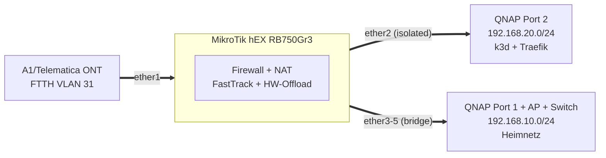

# MikroTik hEX (RB750Gr3) Dual-Stack Provisioning

Idempotentes RouterOS v7 Provisioning mit Dual-Stack (IPv4 / IPv6-PD), FTTH VLAN 31 WAN-Uplink und isolierter Server-Zone für k3d Kubernetes.

## Architektur



### Zonen & Subnetze

| Zone | Interface | IPv4 | IPv6 | Zweck |
|:-----|:----------|:-----|:-----|:------|
| `INTERNET` | `vlan31-internet` (ether1) | DHCP-Client | DHCPv6-PD /64 | FTTH WAN Uplink |
| `SERVER-ZONE` | `ether2` | `192.168.20.1/24` | IPv4 NAT | k3d Cluster, Traefik Ingress |
| `HEIMNETZ` | `bridge-heimnetz` (ether3–5) | `192.168.10.1/24` | SLAAC /64 | NAS (SMB), AP, Kabelnetz |

### Port-Belegung

| Port | Gerät | Zone |
|:-----|:------|:-----|
| `ether1` | ONT (VLAN 31) | INTERNET |
| `ether2` | QNAP Port 2 → k3d / Traefik | SERVER-ZONE |
| `ether3` | QNAP Port 1 → SMB / QTS | HEIMNETZ (HW-Offload) |
| `ether4` | Archer AXE75 AP (Family + IoT) | HEIMNETZ (HW-Offload) |
| `ether5` | Gigabit-Switch → Cat6a Dosen | HEIMNETZ (HW-Offload) |

---

## Sicherheitsmodell

### Firewall-Matrix (IPv4 & IPv6)

| Source → Dest | Status | Anmerkung |
|:--------------|:------:|:----------|
| `HEIMNETZ` → `INTERNET` | ✅ | FastTrack-beschleunigt |
| `HEIMNETZ` → `SERVER-ZONE` | ✅ | kubectl, Lens, Dev |
| `SERVER-ZONE` → `INTERNET` | ✅ | Image Pulls, APIs |
| `SERVER-ZONE` → `HEIMNETZ` | 🔴 **DROP** | Kritische Isolation |
| `INTERNET` → `SERVER-ZONE` | 🟡 80/443 | Nur dstnat → Traefik |
| `INTERNET` → `HEIMNETZ` | 🔴 **DROP** | Default Drop |

### Management Hardening

Deaktiviert: Telnet, FTP, HTTP, API, API-SSL, UPnP, Bandwidth-Server, RoMON, Cloud DDNS, LEDs.
Aktiv: SSH (`strong-crypto=yes`) + WinBox — nur aus `HEIMNETZ`.
L2: MAC-Server/Winbox + Neighbor Discovery auf `HEIMNETZ` beschränkt.

### DNS-Architektur

| Stufe | Resolver | Ziel |
|:------|:---------|:-----|
| Lokal | MikroTik Cache (`192.168.10.1`) | Alle Heimnetz-Clients |
| Primär | Telematica (`94.16.16.94/16`) | Provider-Backbone |
| Fallback | Cloudflare (`1.1.1.1`) | Redundanz |
| Kids | Cloudflare Family (`1.1.1.3`) | DHCP Opt 6 + dst-nat + DoT-Block |
| Server-Zone | `1.1.1.1` / `8.8.8.8` direkt | Entkoppelt vom Router-Cache |

**Split-DNS:** `oettl.home.work` + `*.oettl.home.work` → `192.168.20.10` (k3d Traefik, Zero Hairpin-NAT).

### Jugendschutz (Kid-Control)

Vierschichtiger Bypass-Schutz für Kids-Geräte (`KIDS-DEVICES` Adressliste):

1. **DHCP Option 6** → Cloudflare Family DNS
2. **dst-nat Port 53** → DNS zwingend auf `1.1.1.3` umgeleitet
3. **Drop Port 853** → DoT-Bypass gesperrt
4. **IPv6 komplett gesperrt** (DNS + Internet) → erzwingt IPv4-Pfad

Zeitsteuerung: 06:00–24:00 Uhr aktiv, 00:00–06:00 gesperrt.

---

## Quickstart

```bash
# 1. Provisioning (erkennt 192.168.88.1 oder 192.168.10.1 automatisch):
./deploy.sh

# 2. Update-Check (read-only):
./bin/update-router.sh --check

# 3. Sicheres RouterOS + Bootloader Update:
./bin/update-router.sh
```

Ausführliche Anleitung: **[INSTALL.md](INSTALL.md)** (Verkabelung, AP-Setup, Endgeräte, Smoke Tests, SOPS-Workflow).

---

## Secret Management (SOPS + age)

| Datei | Inhalt | Speicherort |
|:------|:-------|:------------|
| `setup.rsc` | Router-Config (Klartext) | Lokal (`.gitignore`) |
| `setup.enc.rsc` | Router-Config (verschlüsselt) | Git |
| `inventory.yaml` | Geräte-Inventar (Klartext) | Lokal (`.gitignore`) |
| `inventory.enc.yaml` | Geräte-Inventar (verschlüsselt) | Git |

```bash
# Commit mit Auto-Encrypt:
git scommit -m "feat: add device"

# Manuell ver-/entschlüsseln:
./bin/encrypt.sh && ./bin/decrypt.sh
```

Git-Hooks: `pre-commit` (Auto-Encrypt + Leak-Prevention), `post-merge` / `post-checkout` (Auto-Decrypt).
Setup: `./bin/setup-git.sh`

---

## Repo-Struktur

```
├── setup.rsc              # RouterOS Provisioning Script (lokal)
├── setup.enc.rsc          # ↑ SOPS-verschlüsselt (Git)
├── inventory.yaml         # Geräte-Inventar (lokal)
├── inventory.enc.yaml     # ↑ SOPS-verschlüsselt (Git)
├── deploy.sh              # SCP + SSH Import auf Router
├── bin/
│   ├── update-router.sh   # Safe RouterOS + Bootloader Update
│   ├── encrypt.sh         # SOPS Encrypt
│   ├── decrypt.sh         # SOPS Decrypt
│   ├── commit.sh          # Auto-Detect + Encrypt + Commit
│   └── setup-git.sh       # Git-Hooks + Diff-Filter Setup
├── k3d.yaml               # k3d Cluster Config (lokal)
├── INSTALL.md             # Verkabelung, Endgeräte, Smoke Tests
└── gemini.md              # Agent Task Specification
```
