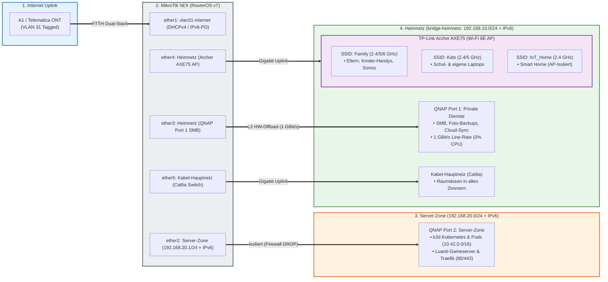

# MikroTik hEX (RB750Gr3) Dual-Stack Provisioning

Automatisierte Bereitstellung und gehärtete Konfiguration für MikroTik hEX Router (RouterOS v7) mit nativem Dual-Stack (IPv4 / IPv6-PD), FTTH VLAN 31 WAN-Uplink (A1/Telematica ONT) und isolierter **Server-Zone für k3d Kubernetes & Luanti-Gameserver**.

---

## 1. Netzwerk-Topologie & Architektur



---

## 2. Subnetze & Port-Mapping

| Zone / Subnetz | Interface | IP-Bereich (IPv4) | IPv6 | Zielgeräte / Funktion |
|---|---|---|---|---|
| **`INTERNET`** | `vlan31-internet` (ether1) | DHCP-Client (Default Route) | DHCPv6-PD (`/64`, Pool: `ipv6-pd`) | Uplink zu A1 / Telematica ONT (VLAN 31) |
| **`SERVER-ZONE`** | `ether2` | `192.168.20.1/24` (Pool: `.100-.200`) | SLAAC (`advertise=yes`) | QNAP Port 2: k3d Kubernetes, Luanti-Gameserver & Traefik |
| **`HEIMNETZ`** | `bridge-heimnetz` (ether3-5) | `192.168.10.1/24` (Pool: `.100-.200`) | SLAAC (`advertise=yes`) | Privates Familiennetzwerk (Details unten) |

### Port-Belegung im `HEIMNETZ` (ether3, ether4, ether5)

* **`ether3`:** QNAP NAS Port 1 $\rightarrow$ Interne Netzlaufwerke (SMB), automatische Foto-Backups, Cloud-Synchronisation und QTS Web-Administration.
* **`ether4`:** TP-Link Archer AXE75 (AP-Modus) $\rightarrow$ Verteilt die WLAN-Netzwerke (`Family`, `Kids`, `IoT_Home`).
* **`ether5`:** Kabel-Hauptnetz $\rightarrow$ Zentraler Switch mit Cat6a Raumverkabelung in alle Zimmer.

### WLAN SSIDs auf dem TP-Link Archer AXE75 (AP-Modus)

| Netzwerk-Typ | SSID | Frequenzbänder | Zielgruppe / Verwendung | Zugriff auf QNAP Port 1 | Zugriff auf k3d Cluster |
|---|---|---|---|:---:|:---:|
| **Haupt-WLAN (Main)** | `Family` | 2,4 GHz / 5 GHz / 6 GHz (Smart Connect) | **Hauptnetz:** Eltern, Arbeitsrechner, Laptops, **Kinder-Smartphones**, **Sonos-Lautsprecher** | **JA (SMB / QTS)** | **JA (kubectl / Lens / Dev)** |
| **Kindernetz (WLAN)** | `Kids` | 2,4 GHz / 5 GHz (Separates Passwort) | **Schul- & Kinder-Laptops:** Schullaptops, persönliche Laptops der Kinder, Tablets | **JA (SMB / Streaming)** | **JA (Web / Games)** |
| **IoT-Netzwerk** | `IoT_Home` | 2,4 GHz | **Smart Home:** Saugroboter, Portasplit, isolierte IoT-Aktoren (*AP-Isolation aktiv*) | **NEIN (Geblockt)** | **NEIN (Geblockt)** |

---

## 3. Zugriffs- & Sicherheits-Matrix

| Quell-Zone | Ziel-Zone | Zugriff | Schutzmechanismus & Performance |
|---|---|:---:|---|
| **`Kabel-Hauptnetz` (ether5)** | **QNAP Port 1 (SMB / QTS)** | **ERLAUBT** | **L2 Hardware Offloading:** Echte 1 GBit/s Leitungsgeschwindigkeit (<1ms Latenz, 0% CPU-Last) |
| **`Family` & `Kids` WLAN (ether4)** | **QNAP Port 1 (SMB / QTS)** | **ERLAUBT** | **High-Speed WLAN:** Direktes Gigabit-Switching auf `bridge-heimnetz` |
| **`HEIMNETZ`** | **`SERVER-ZONE` (k3d Cluster)** | **ERLAUBT** | Firewall Forward `HEIMNETZ -> SERVER-ZONE accept` (`kubectl`, Lens, Web) |
| **`SERVER-ZONE`** | **`HEIMNETZ` & QNAP Port 1** | **GEBLOCKT** | MikroTik Firewall Rule (`SERVER-ZONE -> HEIMNETZ DROP` in IPv4 & IPv6) |
| **`SERVER-ZONE`** | **`INTERNET` (WAN)** | **ERLAUBT** | Firewall Forward `SERVER-ZONE -> INTERNET accept` (Image Pulls, Helm, APIs) |
| **`IoT_Home` (Smart Home)** | **`HEIMNETZ` & QNAP Port 1** | **GEBLOCKT** | AP-Isolation auf dem Archer AXE75 (*Access Local Network: Disabled*) |
| **`INTERNET`** | **`HEIMNETZ` (Privat)** | **GEBLOCKT** | MikroTik Default Drop, kein NAT / kein Routing |
| **`INTERNET`** | **`SERVER-ZONE` (k3d Ingress)** | **NUR 80/443** | Optionales Port-Forwarding (dstnat) für Traefik Web-Ingress |

---

## 4. High-Performance & Hardware-Offloading (NAS-Zugriff)

- **MediaTek MT7621 Switch-Chip (Hardware Offloading `hw=yes`):**
  - Der Datenverkehr zwischen **Kabel-Hauptnetz (`ether5`)**, **WLAN Access Point (`ether4`)** und **QNAP NAS Port 1 (`ether3`)** wird direkt in Hardware auf dem Switch-Chip des MikroTik hEX verarbeitet.
  - **Zero CPU-Overhead:** Große Dateitransfers (SMB/NFS, TimeMachine Backups, Videostreaming) belasten den Router-Prozessor nicht und laufen mit voller Gigabit-Drahtgeschwindigkeit (115–120 MB/s).
- **Wi-Fi 6E Tri-Band Durchsatz:**
  - Laptops und Smartphones auf `SSID: Family` nutzen 5 GHz und 6 GHz Kanäle für maximale WLAN-Datenraten direkt zum NAS.

- **Server-Zone Isolation:** 
  - `HEIMNETZ` $\rightarrow$ `SERVER-ZONE` ist erlaubt (Management / `kubectl` / Dev-Testing).
  - `SERVER-ZONE` $\rightarrow$ `HEIMNETZ` wird **strikt geblockt** (`drop` in IPv4 & IPv6).
  - `SERVER-ZONE` $\rightarrow$ `INTERNET` ist erlaubt (Image-Pulls von `docker.io`, `registry.k8s.io`, `ghcr.io`, Helm Repos).
- **Router-Management & Hardening (Management Plane):**
  - **Dienste gehärtet:** Telnet, FTP, HTTP (WWW), API und API-SSL sind **vollständig deaktiviert**.
  - **Zugriffsbeschränkung:** WinBox und SSH sind ausschließlich aus dem `HEIMNETZ` (`192.168.10.0/24`) erreichbar.
  - **SSH-Sicherheit:** `strong-crypto=yes` forciert moderne kryptografische Ciphers.
  - **Layer-2 Härtung:** MAC-Server & MAC-Winbox sind strikt auf die Interface-Liste `HEIMNETZ` beschränkt; MAC-Ping ist deaktiviert.
  - **Schutz vor Informationslecks:** Neighbor Discovery (MNDP/CDP/LLDP) ist auf `INTERNET` und `SERVER-ZONE` deaktiviert (`discover-interface-list=HEIMNETZ`).
  - **Tools deaktiviert:** Bandwidth-Server, RoMON, UPnP, Web-Proxies und Cloud DDNS sind abgeschaltet.
- **Hardware-Disziplin:**
  - Alle LEDs dauerhaft deaktiviert (`all-leds-off=always`).

---

## 5. Checkliste für Installation & Inbetriebnahme

### Phase 1: Physische Verkabelung
- [ ] **ether1 (WAN):** Mit LAN-Port des A1 / Telematica ONT verbinden.
- [ ] **ether2 (Server-Zone):** Mit **QNAP NAS Port 2** (k3d Cluster / DMZ) verbinden.
- [ ] **ether3 (Heimnetz):** Mit **QNAP NAS Port 1** (SMB / QTS Speicher) verbinden.
- [ ] **ether4 (Heimnetz):** Mit dem WAN/LAN-Port des **TP-Link Archer AXE75** verbinden.
- [ ] **ether5 (Kabel-Hauptnetz):** Mit dem zentralen **Gigabit-Switch** (Cat6a Raumverkabelung) verbinden.

---

### Phase 2: RouterOS Provisioning & Deployment
- [ ] **1. Router-Verbindung herstellen:** PC per LAN-Kabel an `ether3`, `ether4` oder `ether5` anschließen (Router hat ab Werk IP `192.168.88.1`).
- [ ] **2. Deployment-Skript ausführen:**
  ```bash
  ./deploy.sh
  ```
- [ ] **3. Admin-Passwort setzen:** Sofort via SSH oder WinBox auf `192.168.10.1` verbinden und ein starkes Passwort vergeben:
  ```routeros
  /user set admin password="DeinSicheresPasswort"
  ```
- [ ] **4. Status prüfen:** RouterOS Dual-Stack Status kontrollieren:
  ```routeros
  /ip dhcp-client print
  /ipv6 dhcp-client print
  /ip address print
  /ipv6 address print
  ```

---

### Phase 3: Konfiguration der Endgeräte

#### A. TP-Link Archer AXE75 (WLAN Access Point)
- [ ] **Betriebsmodus:** In der TP-Link Web-GUI auf **Access Point (AP-Modus)** umstellen.
- [ ] **SSID `Family` einrichten:**
  - Bänder: 2.4 GHz, 5 GHz, 6 GHz (Smart Connect empfohlen)
  - Sicherheit: WPA2/WPA3-Personal
  - Verwendung: Eltern, Arbeitsrechner, Laptops, **Kinder-Smartphones**, **Sonos-Lautsprecher**
- [ ] **SSID `Kids` einrichten:**
  - Bänder: 2.4 GHz / 5 GHz
  - Sicherheit: WPA2/WPA3-Personal (eigenes Passwort)
  - Verwendung: **Schullaptops & persönliche Laptops der Kinder**, Tablets, Konsolen (keine AP-Isolation)
  - Zeitsteuerung / Kinderschutz (optional): WLAN-Zeitplan (Wi-Fi Schedule / Nachtabschaltung) für `Kids` SSID aktivieren.
- [ ] **SSID `IoT_Home` einrichten:**
  - Band: Nur 2.4 GHz
  - Sicherheit: WPA2-Personal
  - **KRITISCH:** Option **"Access Local Network" / "AP-Isolation" AKTIVIEREN** (Geräte dürfen nicht ins LAN funken)
  - Verwendung: Saugroboter, Portasplit, smarte Steckdosen

#### B. QNAP NAS (QTS Betriebssystem)
- [ ] **Port 1 (Adapter 1 - Heimnetz):** Auf DHCP stellen $\rightarrow$ Erhält IP im Bereich `192.168.10.x`.
- [ ] **Port 2 (Adapter 2 - Server-Zone):** Auf DHCP stellen $\rightarrow$ Erhält IP im Bereich `192.168.20.x`.
- [ ] **Netzwerk-Prüfung:** Unter *Netzwerk- und virtueller Switch* sicherstellen, dass **KEINE Bridge** zwischen Adapter 1 und Adapter 2 existiert!
- [ ] **Dienstebindung:** In der QTS-Systemsteuerung sicherstellen:
  - QTS Web-GUI (8080/443) und SMB-Dateifreigaben nur auf **Adapter 1** lauschen lassen.
  - k3d Kubernetes Cluster / Docker Container an **Adapter 2** binden.
- [ ] **QuFirewall (optional, empfohlen):** Auf Adapter 2 Zugriffe auf QTS-Systemdienste blockieren.

#### C. Sonos-Lautsprecher
- [ ] Alle Sonos-Boxen mit dem WLAN **`Family`** verbinden (oder per LAN-Kabel an Raumdosen anschließen).
- [ ] Sonos App auf Smartphone öffnen und Musikwiedergabe / AirPlay / Spotify Connect testen.

---

### Phase 4: Sicherheits- & Funktionstests (Smoke Tests)
- [ ] **Test 1: Internetzugang (IPv4 & IPv6)**
  - Vom PC aus `ping 1.1.1.1` und `ping6 google.com` prüfen.
- [ ] **Test 2: High-Speed NAS-Zugriff (SMB)**
  - Netzlaufwerk von QNAP Port 1 (`\\192.168.10.x`) einbinden und eine Testdatei kopieren (Ziel: ~115 MB/s).
- [ ] **Test 3: k3d Cluster Management aus Heimnetz**
  - Vom Arbeits-PC aus: `kubectl get nodes` oder Web-Zugriff auf Port 2 testen $\rightarrow$ **Erfolgreich**.
- [ ] **Test 4: DMZ-Isolation (Kritischer Test)**
  - Aus einem k3d Pod oder von Port 2: `ping 192.168.10.1` und `ping 192.168.10.x` testen $\rightarrow$ **Muss fehlschlagen (Timeout/DROP)**.
  - Drop-Counter auf MikroTik prüfen:
    ```routeros
    /ip firewall filter print stats where comment~"CRITICAL"
    ```

---

## 6. Checkliste für den laufenden Betrieb & Wartung

### Regelmäßige Wartung (Monatlich / Quartalsweise)
- [ ] **1. RouterOS Konfigurations-Backup erstellen:**
  ```routeros
  /export file=backup-config
  /system backup save name=backup-system
  ```
  *(Die `.rsc` und `.backup` Dateien anschließend per SCP oder WinBox auf den PC/NAS sichern).*
- [ ] **2. RouterOS Firmware-Updates prüfen (Stable Channel):**
  ```routeros
  /system package update check-for-updates
  /system package update download-and-install
  /system routerboard upgrade
  ```
- [ ] **3. QNAP & Container-Updates:** Regelmäßige Updates von QTS und den Kubernetes Pods in der Server-Zone durchführen.

---

## 7. Notfall / Factory Reset
Falls der Router nicht mehr erreichbar ist oder die Konfiguration zurückgesetzt werden soll:
1. Stromstecker des MikroTik hEX ziehen.
2. Reset-Taste gedrückt halten und Strom anschließen.
3. Warten bis die ACT-LED blinkt (ca. 5 Sek.) und Taste sofort loslassen.
4. Router startet mit Werkseinstellungen (`192.168.88.1`). Anschließend `./deploy.sh` erneut ausführen.

