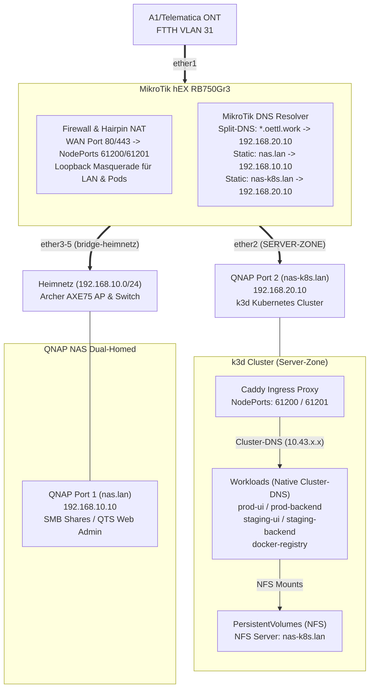

# MikroTik hEX (RB750Gr3) Dual-Stack Provisioning

Idempotentes RouterOS v7 Provisioning mit Dual-Stack (IPv4 / IPv6-PD), FTTH VLAN 31 WAN-Uplink und isolierter Server-Zone für k3d Kubernetes.

## Architektur



### Zonen & Subnetze

| Zone | Interface | IPv4 | IPv6 | Hostname | Zweck |
|:-----|:----------|:-----|:-----|:---------|:------|
| `INTERNET` | `vlan31-internet` (ether1) | DHCP-Client | DHCPv6-PD /64 | – | FTTH WAN Uplink |
| `SERVER-ZONE` | `ether2` | `192.168.20.1/24` | IPv4 NAT | `nas-k8s.lan` (`.20.10`) | k3d Cluster, Caddy Ingress, NFS-Storage, DBs |
| `HEIMNETZ` | `bridge-heimnetz` (ether3–5) | `192.168.10.1/24` | SLAAC /64 | `nas.lan` (`.10.10`) | QTS Admin, SMB Speicher, AP, Kabelnetz |

### Port-Belegung

| Port | Gerät | Zone | DNS Name |
|:-----|:------|:-----|:---------|
| `ether1` | ONT (VLAN 31) | INTERNET | – |
| `ether2` | QNAP Port 2 → k3d / Caddy Ingress | SERVER-ZONE | `nas-k8s.lan` (`192.168.20.10`) |
| `ether3` | QNAP Port 1 → SMB / QTS Web-UI | HEIMNETZ (HW-Offload) | `nas.lan` (`192.168.10.10`) |
| `ether4` | Archer AXE75 AP (Family + IoT) | HEIMNETZ (HW-Offload) | `192.168.10.2` |
| `ether5` | Gigabit-Switch → Cat6a Dosen | HEIMNETZ (HW-Offload) | – |

---

## Sicherheitsmodell

### Firewall-Matrix (IPv4 & IPv6)

| Source → Dest | Status | Anmerkung |
|:--------------|:------:|:----------|
| `HEIMNETZ` → `INTERNET` | ✅ | FastTrack-beschleunigt |
| `HEIMNETZ` → `SERVER-ZONE` | ✅ | kubectl (`192.168.20.10:6443`), Lens, Dev Web |
| `SERVER-ZONE` → `INTERNET` | ✅ | Image Pulls, externe APIs |
| `SERVER-ZONE` → `HEIMNETZ` | 🔴 **DROP** | **Kritische Isolation** (Schutz für Heimnetz & QTS Port 1) |
| `INTERNET` → `SERVER-ZONE` | 🟡 80/443 | dstnat → Caddy Ingress (NodePorts 61200 / 61201) |
| `INTERNET` → `HEIMNETZ` | 🔴 **DROP** | Default Drop |

### Ingress & Hairpin-NAT

* **Caddy Ingress Reverse Proxy:** Terminiert SSL/TLS auf NodePort 61201 (HTTPS) und 61200 (HTTP).
* **Port-Forwarding (dstnat):** WAN Port 80/443 werden direkt auf die Caddy NodePorts gemappt.
* **Hairpin-NAT (Loopback Masquerade):** Erlaubt es internen Clients und Pods, öffentliche Hostnamen wie `registry.oettl.work` über die WAN-IP anzusprechen.
* **Cluster-internes DNS-Routing:** Caddy leitet Requests nicht über NodePorts oder Host-IPs weiter, sondern spricht Pods direkt über native Kubernetes Cluster-DNS-Namen an (`prod-ui.immoad-prod:1080`, `prod-backend.immoad-prod:5000`, etc.).

### Management Hardening

Deaktiviert: Telnet, FTP, HTTP, API, API-SSL, UPnP, Bandwidth-Server, RoMON, Cloud DDNS, LEDs.
Aktiv: SSH (`strong-crypto=yes`) + WinBox — nur aus `HEIMNETZ`.
L2: MAC-Server/Winbox + Neighbor Discovery auf `HEIMNETZ` beschränkt.

### DNS-Architektur

| Stufe | Resolver | Ziel |
|:------|:---------|:-----|
| Lokal | MikroTik Cache (`192.168.10.1`) | Alle Heimnetz-Clients |
| Static Port 1 | MikroTik DNS | `nas.lan`, `nas160c30.local` → `192.168.10.10` (Admin, SMB) |
| Static Port 2 | MikroTik DNS | `nas-k8s.lan` → `192.168.20.10` (k3d Cluster, NFS, DB-Ports) |
| Split-DNS | MikroTik DNS | `oettl.work` + `*.oettl.work` → `192.168.20.10` (Caddy Ingress) |
| Primär WAN | Telematica (`94.16.16.94/16`) | Provider-Backbone |
| Fallback | Cloudflare (`1.1.1.1`) | Redundanz |
| Kids | Cloudflare Family (`1.1.1.3`) | DHCP Opt 6 + dst-nat + DoT-Block |
| Server-Zone | `1.1.1.1` / `8.8.8.8` direkt | Entkoppelt vom Router-Cache |

### Jugendschutz (Kid-Control)

Vierschichtiger Bypass-Schutz für Kids-Geräte (`KIDS-DEVICES` Adressliste auf der gemeinsamen SSID `Family`):

1. **DHCP Option 6** → Cloudflare Family DNS
2. **dst-nat Port 53** → DNS zwingend auf `1.1.1.3` umgeleitet
3. **Drop Port 853** → DoT-Bypass gesperrt
4. **IPv6 komplett gesperrt** (DNS + Internet) → erzwingt IPv4-Pfad

Zeitsteuerung: 06:00–24:00 Uhr aktiv, 00:00–06:00 gesperrt.

---

## Quickstart

```bash
# 1. Provisioning (erkennt 192.168.88.1 oder 192.168.10.1 automatisch):
./deploy.sh

# 2. Update-Check (read-only):
./bin/update-router.sh --check

# 3. Sicheres RouterOS + Bootloader Update:
./bin/update-router.sh
```

Ausführliche Anleitung: **[INSTALL.md](INSTALL.md)** (Verkabelung, AP-Setup, Endgeräte, Smoke Tests, SOPS-Workflow).

---

## Secret Management (SOPS + age)

| Datei | Inhalt | Speicherort |
|:------|:-------|:------------|
| `setup.rsc` | Router-Config (Klartext) | Lokal (`.gitignore`) |
| `setup.enc.rsc` | Router-Config (verschlüsselt) | Git |
| `inventory.yaml` | Geräte-Inventar (Klartext) | Lokal (`.gitignore`) |
| `inventory.enc.yaml` | Geräte-Inventar (verschlüsselt) | Git |

```bash
# Commit mit Auto-Encrypt:
git scommit -m "feat: add device"

# Manuell ver-/entschlüsseln:
./bin/encrypt.sh && ./bin/decrypt.sh
```

Git-Hooks: `pre-commit` (Auto-Encrypt + Leak-Prevention), `post-merge` / `post-checkout` (Auto-Decrypt).
Setup: `./bin/setup-git.sh`

---

## Offene Punkte & Bekannte Einschränkungen (Pain Points)

### 1. Kein IPv6 /56 Prefix (Single /64 Limitierung des ISP)
* **Status Quo:** Der Provider (A1/Telematica) delegiert per DHCPv6-PD standardmäßig nur ein einzelnes `/64` Präfix.
* **Architektur-Konflikt:** Nach IPv6-Standard (RFC 4291 / SLAAC) benötigt jedes geroutete Subnetz zwingend eine eigene `/64` Maske. Der MikroTik hEX kann daher nur ein einziges L2-Netzwerk (`bridge-heimnetz`) mit nativen globalen IPv6-Adressen versorgen. Die `SERVER-ZONE` (k3d Cluster) muss isoliert über IPv4 NAT betrieben werden.
* **To-Do:** Beim ISP (Telematica/A1) die Schaltung eines **/56 Präfixes** anfragen/prüfen, um getrennte, native IPv6-Subnetze für alle Zonen (`HEIMNETZ`, `SERVER-ZONE`, zukünftiges Gäste-/IoT-VLAN) ausrollen zu können.

### 2. Dual-Homed QNAP NAS in der DMZ (Architektur- & Budgetkompromiss)
* **Status Quo:** Das QNAP NAS ist über zwei physische Netzwerk-Schnittstellen gleichzeitig an zwei getrennte Sicherheitszonen angebunden:
  * **Port 1 (`nas.lan` / 192.168.10.10):** Privates `HEIMNETZ` (SMB-Shares, QTS Web-Admin).
  * **Port 2 (`nas-k8s.lan` / 192.168.20.10):** Isolierte `SERVER-ZONE` (k3d Kubernetes Cluster, Caddy Ingress, öffentlich exponiert via Port-Forwarding).
* **Sicherheitsrisiko:** Sollte ein Angreifer über einen exponierten Web-Container (z. B. Ingress/Backend) einen Container-Escape auf den QNAP-Host erzielen, befindet er sich auf einem Gerät, das eine direkte Netzwerkkarte im vertrauenswürdigen Heimnetz hat. Die Firewall-Isolation des MikroTik-Routers wird auf Host-Ebene umgangen.
* **Pain Point / Trade-Off:** Ein theoretisches Zero-Trust- und DMZ-Design verlangt eine **vollständige physische Trennung**: Ein dedizierter Compute-Knoten in der DMZ und ein separates Speicher-NAS im internen Storage-Netz. Ein solcher Hardware-Umbau ist aktuell **wirtschaftlich nicht sinnvoll** und zu teuer.
* **Architektur-Urteil:** Das Setup ist **kein Zero Trust – und das ist völlig in Ordnung**. Die pragmatische DMZ-Zonensegmentierung liefert für das aktuelle Risikoprofil 90 % der Schutzwirkung. Sollte die externe Angriffsfläche zukünftig wachsen (weitere öffentliche Dienste), ist Zero Trust über eine **„externe DMZ in der DMZ“** (z. B. vorgelagerter Identity-Aware Proxy / Micro-Enklave) der wirtschaftlich und architektonisch modulare Skalierungspfad.
* **Aktuelle Schutzmaßnahmen (Mitigations):**
  * Strikte Dienstebindung in QTS: QTS-Management & SMB sind ausschließlich an Adapter 1 gebunden.
  * Keine Software-Brücke zwischen den Netzwerk-Adaptern im QTS.
  * Router-Firewall verwirft jeglichen L3-Verkehr aus `SERVER-ZONE` nach `HEIMNETZ` (`action=drop`).

---

## Repo-Struktur

```
├── setup.rsc              # RouterOS Provisioning Script (lokal)
├── setup.enc.rsc          # ↑ SOPS-verschlüsselt (Git)
├── inventory.yaml         # Geräte-Inventar (lokal)
├── inventory.enc.yaml     # ↑ SOPS-verschlüsselt (Git)
├── deploy.sh              # SCP + SSH Import auf Router
├── bin/
│   ├── update-router.sh   # Safe RouterOS + Bootloader Update
│   ├── encrypt.sh         # SOPS Encrypt
│   ├── decrypt.sh         # SOPS Decrypt
│   ├── commit.sh          # Auto-Detect + Encrypt + Commit
│   └── setup-git.sh       # Git-Hooks + Diff-Filter Setup
├── k3d.yaml               # k3d Cluster Config (lokal)
├── INSTALL.md             # Verkabelung, Endgeräte, Smoke Tests
├── LESSONS_LEARNED.md     # Architecture Debrief & C-Level LinkedIn Post Drafts
└── gemini.md              # Agent Task Specification
```
